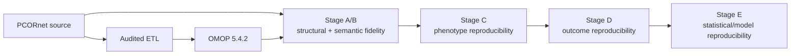

# PCORnet to OMOP validation

This repository contains an audited PCORnet-to-OMOP ETL and a staged validation study asking whether a study remains scientifically reproducible after transformation to OMOP CDM v5.4.2.

The main question is:

> **If the same study is run independently in PCORnet and in the transformed OMOP data, do we obtain the same cohort, variables, outcomes, estimates, and scientific conclusion? If not, where did divergence enter and why?**

## Start here

Collaborators and students should read the numbered documentation in order:

1. [`docs/01_READ_ME_FIRST.md`](docs/01_READ_ME_FIRST.md)
2. [`docs/02_STUDY_DESIGN_AND_DECISIONS.md`](docs/02_STUDY_DESIGN_AND_DECISIONS.md)
3. [`docs/03_RESULTS_THROUGH_STAGE_E.md`](docs/03_RESULTS_THROUGH_STAGE_E.md)
4. [`docs/04_REPRODUCIBILITY_AND_RERUN.md`](docs/04_REPRODUCIBILITY_AND_RERUN.md)
5. [`docs/05_CODE_REVIEW_GUIDE.md`](docs/05_CODE_REVIEW_GUIDE.md)
6. [`docs/06_MANUSCRIPT_AND_REVIEW_GUIDE.md`](docs/06_MANUSCRIPT_AND_REVIEW_GUIDE.md)

Older development notes, lock records, and superseded manuscript fragments are retained under `docs/archive/` for provenance but are not required reading.

## Study layers



## Current status

- Canonical branch: `main`
- Frozen publication ETL commit: `887e6f4d60a6b185e58b3c9fe8887472b49777e3`
- Stages A–E: complete for routine publication work
- Generated `results/`: intentionally gitignored
- Patient-level outputs and credentials: must not be committed

The key empirical finding is that conditional fidelity was extremely high when the same patients and index dates were held fixed, while end-to-end estimates differed because an upstream diagnosis-date eligibility policy changed cohort membership.

## Installation

```bash
python -m venv .venv
source .venv/bin/activate
python -m pip install --upgrade pip
python -m pip install -e '.[etl,analysis,dev]'
```

Create a local configuration from the tracked example and keep secrets out of Git:

```bash
cp config/etl.example.yaml config/etl.yaml
export OMOP_SQL_PASSWORD='your-password'
```

## Code orientation

- ETL implementation: `src/pcornet_omop_validation/etl/`
- Study analyses: `src/pcornet_omop_validation/study/`
- Locked scientific definitions: `study_definitions/`
- Current documentation: `docs/01_...` through `docs/06_...`
- Historical provenance: `docs/archive/`

Each ETL/study code directory also contains a README explaining scientific conventions and how to review the modules.

## Data governance

This repository is public. Do not commit source parquet files, Athena vocabulary packages, database credentials, patient identifiers, row-level predictions, or other row-level sensitive outputs. Aggregate outputs must be disclosure-reviewed before being added to documentation.
