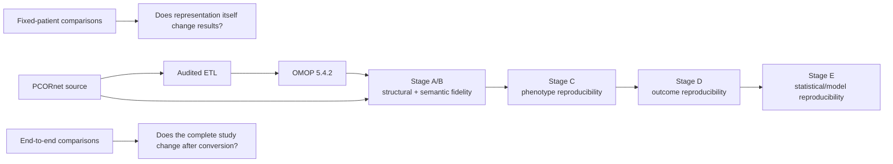

# 01 — Read this first

This repository evaluates whether a study implemented in PCORnet remains scientifically reproducible after transformation to OMOP CDM v5.4.2.

The central question is not simply whether rows were copied correctly. It is:

> **If the same study is run independently in PCORnet and in the transformed OMOP data, do we obtain the same cohort, variables, outcomes, estimates, and scientific conclusion? If not, where did divergence enter and why?**

## Recommended reading order

Read these seven files in order:

1. **`01_READ_ME_FIRST.md`** — orientation, study question, and repository map.
2. **`02_STUDY_DESIGN_AND_DECISIONS.md`** — what was tested, why each validation layer exists, and which scientific decisions were frozen.
3. **`03_RESULTS_THROUGH_STAGE_E.md`** — consolidated quantitative results from Stages A–E.
4. **`04_REPRODUCIBILITY_AND_RERUN.md`** — how the ETL/analyses were frozen, what may be rerun, and what outputs are intentionally not committed.
5. **`05_CODE_REVIEW_GUIDE.md`** — how to read the ETL and study code, including the files where scientific choices are implemented.
6. **`06_MANUSCRIPT_AND_REVIEW_GUIDE.md`** — current manuscript framing, reviewer questions, limitations, and what feedback is most useful.
7. **`07_PUBLICATION_FIGURES.md`** — reproducible publication figures, Nature-oriented artwork standards, and figure-generation commands.

Historical development notes, interim lock records, and superseded manuscript fragments are retained under `docs/archive/`. They are provenance, not required reading.

## Study at a glance

## The key result

When the **same patients, index dates, and follow-up** were compared, mapped clinical information and downstream analyses were preserved extremely well: fixed-index 30/90-day acute-care outcomes were exact, conventional logistic-regression associations were nearly identical, and logistic predicted probabilities correlated at approximately 0.999994.

However, when each CDM was allowed to construct the study population independently, the final risks and model performance differed. The dominant reason was an upstream eligibility interaction: the PCORnet stroke phenotype could use encounter-date fallback when `DX_DATE` was missing, whereas the frozen ETL required a diagnosis date and excluded those diagnoses.

A post-freeze harmonized sensitivity imposed the same nonmissing-`DX_DATE` requirement on both sides. Under that symmetric eligibility rule, D0, D1, and D3 phenotype membership and index dates were reproduced exactly.

The scientific lesson is therefore:

> **Technical transformation fidelity does not automatically guarantee end-to-end study reproducibility. Cohort eligibility and selection must be validated explicitly because selective upstream loss can propagate into outcome estimates, covariate distributions, effect estimates, and prediction models.**

## What collaborators should review

Please focus feedback on:

- whether the fixed-cohort versus end-to-end distinction is scientifically clear;
- whether any ETL policy should be described differently from an ETL defect;
- whether the causal explanation for cohort divergence is adequately supported;
- whether the manuscript overstates generalizability beyond this dataset, ETL, phenotype, and outcome;
- whether the main/Extended Data figure split communicates the result without redundancy;
- whether additional analyses are truly necessary or would create unnecessary post-hoc scope.

## Canonical technical anchors

- Canonical branch: `main`
- Frozen publication ETL commit: `887e6f4d60a6b185e58b3c9fe8887472b49777e3`
- OMOP target: CDM v5.4.2
- Current repository history includes completed Stages A–E.
- Generated `results/` and rendered `figures/generated/` are intentionally gitignored; committed documentation and figure-data artifacts contain disclosure-reviewed aggregate summaries rather than patient-level outputs.
