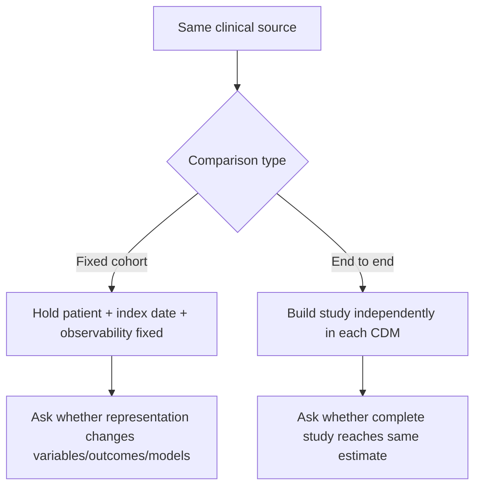

# 02 — Study design and scientific decisions

## Objective

The study asks whether a PCORnet-to-OMOP transformation preserves what matters for research, from individual clinical semantics through final scientific estimates.

Rather than treating “validation” as one number, the project separates five layers:

| Stage | Question | Why it matters |
| --- | --- | --- |
| A | Did the ETL follow explicit structural rules? | Row counts can legitimately differ because of exclusions, one-to-many mapping, and cross-domain routing. |
| B | Were mapped patient-level clinical semantics preserved? | A technically valid ETL should retain the clinical meaning of mapped events. |
| C | Do complete computable phenotypes select the same patients and index dates? | Small source/target semantic differences can change who enters a study. |
| D | Are downstream outcomes reproduced? | Even with cohort differences, the outcome itself may or may not be faithfully represented. |
| E | Are covariates, associations, and prediction models reproducible? | Scientific conclusions depend on the full analytical pipeline, not only event counts. |

## Two complementary estimands

A central design choice is to separate **conditional/fixed-cohort fidelity** from **end-to-end reproducibility**.

### Fixed-cohort analyses

Use the same patients and the same study anchor. These analyses isolate differences introduced by representation or feature construction after cohort selection.

### End-to-end analyses

Allow PCORnet and OMOP to construct the cohort independently according to the locked study implementation. These analyses intentionally include upstream cohort-selection effects because that is what an investigator would experience when running a study independently in each CDM.

Both are necessary. A transformation can preserve every outcome for shared patients while still changing the final study result because different patients enter the analysis.

## Frozen ETL principles

The publication ETL was frozen at commit `887e6f4d60a6b185e58b3c9fe8887472b49777e3` before downstream patient-level validation.

The following policies were deliberate and remain scientifically important:

1. **Missing required dates are excluded rather than replaced with artificial sentinel dates.** This avoids inventing chronology, but it can affect cohort eligibility.
2. **Unmapped source semantics are retained with concept `0` when OMOP permits it.** Coverage limitations are therefore distinguished from silently dropped records.
3. **One-to-many Standard mappings are preserved.** One source event may validly create multiple semantic routes.
4. **Cross-domain routing follows Standard concept domain.** Source table identity does not override the semantic target domain.
5. **Source lineage is retained for validation.** Lineage is used to test transformation fidelity, not to modify the frozen ETL after observing results.
6. **The comparator OMOP database is not treated as an acceptance target.** The goal is defensible PCORnet-to-OMOP transformation, not imitation of a prior build.

## Error versus policy versus representation

Not every source/target difference is an ETL error. Reviewers should distinguish:

| Category | Meaning | Example in this project |
| --- | --- | --- |
| ETL defect | Implementation failed to follow intended transformation | Historical omissions/duplications discovered before the final freeze |
| ETL policy effect | Transformation follows an explicit rule that changes data availability | Excluding DIAGNOSIS rows without `DX_DATE` |
| CDM representation limitation | Source semantic has no exact native target analogue | PCORnet `PDX` has no exact OMOP core field |
| Vocabulary limitation | No defensible unique Standard mapping exists | Concept-zero drug routes or unresolved codes |
| Analysis-definition difference | Study logic differs between representations | Avoided by locked definitions and harmonized sensitivity analyses |

This distinction is important because the remedy differs: fix defects, document policy effects, preserve lineage for non-native semantics, and report vocabulary coverage separately.

## Stroke phenotype logic

The Stage C/D index phenotype uses an adult ischemic-stroke hospitalization/emergency-to-inpatient episode. The original source implementation can choose an encounter-date fallback when the selected diagnosis has no `DX_DATE`.

The frozen ETL, however, requires the diagnosis date to materialize a diagnosis event. Therefore a source episode can qualify in PCORnet while its diagnosis is intentionally absent from OMOP.

That interaction explains the main source-faithful cohort divergence.

The harmonized sensitivity does **not** replace the original analysis. It answers a different question: if both CDMs require a nonmissing diagnosis date, can OMOP reproduce the same phenotype? In this dataset the answer was yes, exactly for D0, D1, and D3.

## Stage D outcome definition

The primary downstream endpoint is any ED, EI, or IP acute-care encounter/visit beginning after index discharge through day 90, with continuous observability through day 90. The 30-day version is secondary.

Equivalence was defined prospectively using both:

- absolute risk difference within ±0.5 percentage points; and
- OMOP/source risk ratio between 0.95 and 1.05.

A nonsignificant p-value was not treated as evidence of equivalence.

## Stage E design

Stage E was prespecified before outcome/model fitting. Core features were:

- age at index;
- female indicator;
- index length of stay;
- prior 365-day acute-care encounter count;
- prior 365-day all-encounter count;
- prior 365-day ischemic-stroke indicator.

The same 90-day outcome was used for multivariable logistic association analysis and three prediction models: logistic regression, ridge logistic regression, and histogram gradient boosting.

The first Stage E execution stopped at an anchor check before any model fitting because its OMOP D0 reconstruction did not exactly inherit the locked Stage C episode-selection logic. A compatibility correction changed only that reconstruction detail and then reproduced all locked Stage C/D anchors exactly before fitting models. The scientific specification was not changed.

## Interpretation guardrails

- Do not claim that OMOP and PCORnet are globally equivalent.
- Do not attribute all end-to-end differences to the OMOP CDM itself.
- Do not treat raw row equality as a universal fidelity criterion.
- Do not combine concept-zero coverage limitations with mapped-event concordance denominators.
- Do not use post-outcome diagnostics as if they were prespecified confirmatory analyses.
- Do not retune the frozen ETL merely to improve downstream concordance.
- Do report where equivalence holds, where it fails, and the mechanism supported by the evidence.
