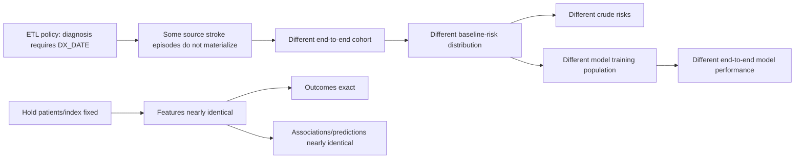

# 03 — Results through Stage E

This file is the canonical collaborator-facing quantitative summary. Historical stage-specific result notes are retained in `docs/archive/` for provenance.

## Stage A — Structural transformation

### Frozen OMOP target counts

| OMOP table | Rows |
| --- | ---: |
| person | 27,089 |
| observation_period | 27,087 |
| visit_occurrence | 1,510,957 |
| condition_occurrence | 7,315,572 |
| procedure_occurrence | 4,182,803 |
| measurement | 85,715,435 |
| observation | 7,319,081 |
| drug_exposure | 48,458,058 |
| device_exposure | 196,660 |
| specimen | 93 |
| death | 6,955 |

### Important exclusions and routing effects

| Source area | Main result |
| --- | --- |
| DIAGNOSIS | 11,484,577 source rows; 3,459,785 excluded for missing `DX_DATE` |
| PROCEDURES | 11,244,947 source rows; 16,924 excluded for missing `PX_DATE` |
| Condition routing | 8,674,973 eligible source events generated 9,045,157 canonical routes because one-to-many routing was preserved |
| OBS_CLIN | Routed across Measurement, Observation, and Condition according to Standard concept domain |
| Drug | 30,988,400 mapped Standard Drug routes and 17,469,480 concept-zero routes |

These are not interpreted as failures of raw row equality. They reflect explicit eligibility, routing, and vocabulary policies.

## Stage B — Patient-level semantic preservation

| Component | Concordance result |
| --- | ---: |
| Encounter | 1,510,957 exact |
| Death | 6,955 exact |
| Condition mapped routes | 8,983,621 exact |
| Procedure mapped routes | 11,121,561 exact |
| Drug mapped Standard routes | 30,988,400 exact |
| Measurement/Observation mapped rows | 92,668,145 exact |
| Uniquely resolved Standard UCUM rows | 58,916,347; 100% agreement |
| Mapped categorical values | 809,630; 100% agreement |

For numeric values, 75,769,622 rows were directly comparable. Of these, 75,644,000 were directly exact. The remaining 125,622 differences were all VITAL rows fully explained by the frozen SQL expression, leaving zero unexplained numeric residuals.

## Stage C — Stroke phenotype reproducibility

### Source-faithful comparison

| Phenotype | PCORnet | Lineage-faithful OMOP | Shared | Source-only | OMOP-only | Jaccard | Exact index date among shared |
| --- | ---: | ---: | ---: | ---: | ---: | ---: | ---: |
| D0 | 9,815 | 6,001 | 6,001 | 3,814 | 0 | 0.611 | 100.00% |
| D1 | 8,624 | 5,246 | 5,245 | 3,379 | 1 | 0.608 | 97.39% |
| D3 | 7,565 | 4,710 | 4,709 | 2,856 | 1 | 0.622 | 97.52% |

Mechanism audits showed that the dominant discrepancy arose from diagnosis-date eligibility: source-selected diagnoses with null `DX_DATE` could still support the PCORnet phenotype through encounter-date fallback, whereas the frozen ETL intentionally excluded those diagnosis records.

### Harmonized nonmissing-`DX_DATE` sensitivity

| Phenotype | PCORnet | OMOP | Shared | Source-only | OMOP-only | Jaccard | Exact index-date agreement |
| --- | ---: | ---: | ---: | ---: | ---: | ---: | ---: |
| D0 | 6,198 | 6,198 | 6,198 | 0 | 0 | 1.000 | 100.00% |
| D1 | 5,246 | 5,246 | 5,246 | 0 | 0 | 1.000 | 100.00% |
| D3 | 4,710 | 4,710 | 4,710 | 0 | 0 | 1.000 | 100.00% |

This sensitivity demonstrates that, under symmetric diagnosis-date eligibility, phenotype membership and index dates were exactly reproduced.

## Stage D — Outcome reproducibility

### Fixed-index acute-care outcomes

| Estimand | Eligible | PCORnet events | OMOP events | PCORnet risk | OMOP risk | Absolute difference, pp | OMOP/source RR | Equivalence |
| --- | ---: | ---: | ---: | ---: | ---: | ---: | ---: | --- |
| 90 day | 3,822 | 1,132 | 1,132 | 29.618% | 29.618% | 0.000 | 1.000 | Met |
| 30 day | 4,374 | 753 | 753 | 17.215% | 17.215% | 0.000 | 1.000 | Met |

For the 90-day endpoint, all 1,132 both-positive patients had exactly matching first-event dates. Median days to first event was 26.0 in both representations.

### End-to-end acute-care outcomes

| Estimand | PCORnet eligible/events/risk | OMOP eligible/events/risk | Absolute difference, pp | OMOP/source RR | Equivalence |
| --- | --- | --- | ---: | ---: | --- |
| 90 day | 6,508 / 1,798 / 27.628% | 3,822 / 1,132 / 29.618% | +1.990 | 1.072 | Not met |
| 30 day | 7,277 / 1,178 / 16.188% | 4,374 / 753 / 17.215% | +1.027 | 1.063 | Not met |

The fixed-index and end-to-end results answer different questions. The fixed-index analysis shows that the outcome was preserved for the same patients. The end-to-end analysis shows that the final study estimate changed because the independently selected cohorts differed upstream.

### Exploratory recurrent stroke

Among 2,531 fixed-index patients observable through 365 days, the implemented recurrent stroke-code endpoint identified 263 PCORnet events and 258 OMOP events, with 2,526/2,531 label agreement (99.80%). Five patients were source-only positive and none were OMOP-only positive. All five retained appropriate visit lineage/timing but lacked qualifying diagnosis-to-condition lineage.

A post-outcome recurrent `PDX=P` sensitivity yielded 170 events in each representation with complete label agreement.

## Stage E — Statistical and prediction-model reproducibility

### Fixed cohort: feature agreement

Among the same 3,822 patients:

| Feature | Patient-level agreement |
| --- | --- |
| Age | 3,822/3,822 exact |
| Female indicator | 3,822/3,822 exact |
| Index length of stay | 3,822/3,822 exact |
| Prior 365-day acute-care count | 3,822/3,822 exact |
| Prior 365-day ischemic-stroke indicator | 3,822/3,822 exact |
| Prior 365-day all-encounter count | 3,806/3,822 exact; mean absolute difference 0.00497; Spearman 0.999989 |

All fixed-cohort standardized mean differences were effectively zero.

### Fixed-cohort association model

OMOP/source odds-ratio ratios were:

| Predictor | OR ratio |
| --- | ---: |
| Age | 1.000015 |
| Female indicator | 1.000019 |
| Index length of stay | 0.999949 |
| Prior acute-care count | 1.000352 |
| Prior all-encounter count | 0.999409 |
| Prior ischemic stroke | 1.000241 |

### Fixed-cohort prediction models

| Model | PCORnet AUROC | OMOP AUROC | AUROC difference | Probability agreement |
| --- | ---: | ---: | ---: | --- |
| Logistic regression | 0.591413 | 0.591345 | -0.000068 | Pearson 0.999994; mean absolute probability difference 0.000084 |
| Ridge logistic | 0.591509 | 0.591427 | -0.000082 | Pearson 0.999994; mean absolute probability difference 0.000084 |
| Histogram gradient boosting | 0.598737 | 0.597730 | -0.001007 | Pearson 0.965218; mean absolute probability difference 0.03698 |

The nonlinear model was more sensitive to tiny feature differences at the patient level, although aggregate discrimination remained close.

### End-to-end population differences

| Feature | PCORnet | OMOP | SMD |
| --- | ---: | ---: | ---: |
| Age, mean years | 67.11 | 67.34 | -0.016 |
| Female | 46.94% | 48.01% | -0.021 |
| Index LOS, mean days | 6.91 | 7.68 | -0.078 |
| Prior acute-care encounters, mean | 0.748 | 0.963 | -0.132 |
| Prior all encounters, mean | 6.77 | 7.49 | -0.058 |
| Prior ischemic stroke | 6.28% | 10.68% | -0.158 |

### End-to-end prediction models

| Model | PCORnet AUROC | OMOP AUROC | Difference | PCORnet Brier | OMOP Brier |
| --- | ---: | ---: | ---: | ---: | ---: |
| Logistic regression | 0.634628 | 0.591345 | -0.043284 | 0.195089 | 0.206229 |
| Ridge logistic | 0.634705 | 0.591427 | -0.043278 | 0.195084 | 0.206210 |
| Histogram gradient boosting | 0.626769 | 0.597730 | -0.029040 | 0.200138 | 0.218271 |

These differences are not evidence that OMOP intrinsically produces worse models. They combine upstream cohort selection with representation-specific feature construction.

## Integrated interpretation

The main scientific conclusion is that **the transformed representation was highly faithful conditional on the same patients and information, while an explicit upstream eligibility rule changed cohort composition and therefore changed end-to-end scientific results.**
