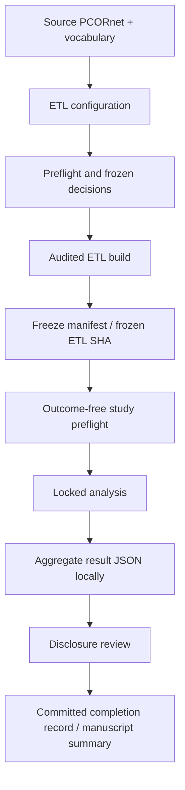

# 04 — Reproducibility and rerun guide

This repository separates **scientific provenance** from **generated local outputs**.

## Canonical anchors

- Canonical branch: `main`
- Frozen publication ETL SHA: `887e6f4d60a6b185e58b3c9fe8887472b49777e3`
- OMOP target: CDM v5.4.2
- Stages A–E: complete for routine publication work

## Why `results/` is not committed

The repository intentionally ignores `results/` and local configuration files. This prevents accidental publication of patient-level or sensitive outputs and avoids turning generated files into source-of-truth artifacts.

The committed reproducibility record consists of:

1. ETL and analysis code;
2. locked study definitions under `study_definitions/`;
3. frozen commit SHAs and definition hashes;
4. disclosure-reviewed aggregate completion records;
5. collaborator-facing quantitative summaries in `docs/`.

Patient identifiers, row-level predictions, row-level discordance tables, credentials, source data, and vocabulary packages must not be committed.

## Reproducibility sequence



## Installation

```bash
python -m venv .venv
source .venv/bin/activate
python -m pip install --upgrade pip
python -m pip install -e '.[etl,analysis,dev]'
```

Create local configuration from the tracked example and provide secrets through environment variables rather than Git.

```bash
cp config/etl.example.yaml config/etl.yaml
export OMOP_SQL_PASSWORD='your-password'
```

## ETL reruns

The clean-build ETL is split into explicitly ordered phases under `src/pcornet_omop_validation/etl/clean_build_phase*.py`. These scripts exist to make dependencies and audit boundaries visible rather than hiding the build inside one monolithic function.

Before a destructive rebuild, review:

- target database/schema;
- configuration and vocabulary paths;
- freeze-decision records;
- clean-reset safeguards;
- expected source limitations, including the absent PCORnet PROVIDER table in this dataset.

The publication analyses should normally use the frozen OMOP build rather than rebuilding merely to reproduce manuscript tables.

## Analysis reruns

Study definitions are stored under `study_definitions/` and are part of the scientific contract. Do not change a definition and rerun an analysis under the same version name.

For outcome-sensitive analyses, the intended pattern is:

1. create/freeze the study definition;
2. run an outcome-free preflight;
3. confirm hashes/anchors;
4. run the analysis;
5. verify locked anchors before interpreting new results.

This pattern was particularly important in Stages D and E.

## Stage E compatibility wrapper

Use:

```bash
python -m pcornet_omop_validation.study.stage_e_statistical_model_reproducibility_anchorfix \
  --config config/etl.yaml
```

rather than calling the original Stage E module directly for the completed publication run.

Why: the first Stage E execution revealed, through a locked-anchor assertion and before model fitting, that the base implementation re-selected the earliest surviving OMOP episode instead of testing materialization of the already selected source D0 episode. The compatibility wrapper corrects only that execution detail and leaves the prespecified features, outcome, split, models, and metrics unchanged.

## What not to rerun casually

Stages A–E are scientifically complete. New analyses should not be added simply because they are possible. A new analysis is justified when it addresses:

- a demonstrated implementation defect;
- a clearly articulated design concern;
- a journal/reviewer requirement; or
- a separately prespecified new research question.

The harmonized Stage C sensitivity is an example of a justified post-freeze analysis because it directly tested whether the original comparison used asymmetric diagnosis-date eligibility.

## Verification after cloning

```bash
git switch main
git pull --ff-only

git status --short
git log -5 --oneline
```

A clean working tree produces no output from `git status --short`.

## Data-governance rule

The repository is public. Before committing any new result artifact, verify that it is aggregate-only and contains no patient identifiers, dates tied to individuals, row-level predictions, credentials, or local filesystem secrets.
