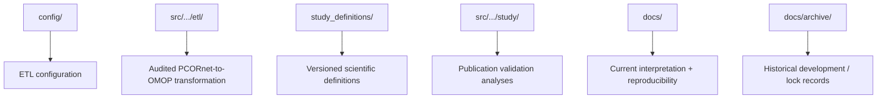

# 05 — Code review guide

This guide is for collaborators and students reviewing the implementation. The goal is to make clear **where scientific decisions live**, **which modules are orchestration versus evidence**, and **which code should not be interpreted as a new analysis definition**.

## Repository map

## ETL code

Primary location: `src/pcornet_omop_validation/etl/`

### How to read it

Start with the clean-build sequence rather than individual legacy helpers:

1. `clean_build_preflight.py`
2. `clean_build_phase1.py`
3. `clean_build_phase2_routes.py`
4. `clean_build_phase3_primary_events.py`
5. `clean_build_phase4_measurement_base.py`
6. `clean_build_phase5_measurement_obsclin.py`
7. `clean_build_phase6_observation.py`
8. `clean_build_phase7_condition_obsclin.py`
9. `clean_build_phase8_drug.py`
10. `clean_build_phase9_procedure_remaining.py`
11. `clean_build_phase10_condition_cross_domain.py`
12. `clean_build_phase11_death.py`
13. `clean_build_phase12_validation.py`
14. `clean_build_phase13_review_decisions.py`
15. `clean_build_phase14_freeze_manifest.py`

The phase files are intentionally explicit. They provide visible checkpoints for semantic routing and validation rather than minimizing line count.

### Important ETL conventions

- A missing required target date causes an explicit exclusion; dates are not fabricated.
- Concept `0` means “no defensible mapped Standard concept,” not “event does not exist.”
- One-to-many Standard mappings are preserved.
- Cross-domain routing follows the mapped Standard concept domain.
- Route ledgers and crosswalks exist to explain provenance and validate materialization.
- The target-side row count is not expected to equal the source-side row count in every domain.

When reviewing code, ask whether a line implements one of these policies before treating an observed count difference as a bug.

## Study code

Primary location: `src/pcornet_omop_validation/study/`

Scientific definitions are **not** supposed to be inferred from Python alone. Read the corresponding JSON in `study_definitions/` first.

### Stage A

Structural eligibility, routing, exclusions, and target-count reconciliation.

### Stage B

Patient-level mapped semantic concordance. Files ending in `*_attribution.py` explain target-side excess provenance; they are not alternate primary estimands.

### Stage C

Key files:

- `stage_c_stroke_d0_concordance.py` — locked source-faithful D0 comparison.
- `stage_c_stroke_d1_d3_concordance.py` — locked D1/D3 extension.
- `stage_c_stroke_harmonized_dxdate_sensitivity.py` — post-freeze symmetric-eligibility sensitivity; it does **not** replace the primary Stage C estimand.
- `*_mechanism_audit.py` and `*_index_date_selection_audit.py` — explanatory diagnostics after discordance was observed.

The main conceptual trap is confusing the original source-faithful phenotype with the harmonized sensitivity. The original asks whether the natural source phenotype survives the frozen ETL; the sensitivity asks whether both CDMs agree when diagnosis-date eligibility is deliberately made symmetric.

### Stage D

Key files:

- `stage_d_stroke_preflight.py` — outcome-free lock verification.
- `stage_d_stroke_analytical_equivalence.py` — primary 30/90-day fixed-index and end-to-end analysis.
- `stage_d_stroke_completion_supplement.py` — completes a prespecified median-time metric that was inadvertently omitted from the first JSON.
- `stage_d_stroke_recurrent_discordance.py` — post-outcome explanatory diagnostic for the exploratory recurrent endpoint.

The primary conceptual distinction is **fixed-index versus end-to-end**. Fixed-index asks whether the same patients have the same outcomes. End-to-end asks whether independently constructed studies produce the same final estimate.

### Stage E

Key files:

- `stage_e_statistical_model_preflight.py` — locks features/models before fitting.
- `stage_e_statistical_model_reproducibility.py` — original prespecified implementation.
- `stage_e_statistical_model_reproducibility_anchorfix.py` — compatibility execution wrapper used for the completed run.

The wrapper exists because the first execution stopped at an anchor assertion before model fitting. It corrects only how the OMOP D0 cohort inherits the already locked source index episode. It must not be interpreted as post-hoc model tuning.

## Why hashes and anchor assertions appear repeatedly

The analysis code deliberately checks:

- frozen ETL SHA;
- study-definition SHA;
- inherited definition SHA;
- clean/outcome-free preflight status;
- previously known cohort/event anchors.

These checks are scientific safeguards. They prevent an apparently successful rerun from silently using a different cohort definition or ETL version.

## SQL embedded in Python

Many study modules execute SQL Server SQL from Python. This is intentional because:

- the cohorts are large;
- joins and temporal eligibility are more efficiently performed in the database;
- Python is used for orchestration, hashing, aggregate post-processing, and model fitting.

When reviewing embedded SQL, focus on:

1. patient linkage;
2. index-event ordering;
3. date eligibility;
4. source-to-target lineage joins;
5. temporal windows;
6. whether a query is fixed-cohort or representation-specific.

## Generated outputs

Analysis modules may write JSON under `results/publication_analysis/...`. These outputs are local and gitignored. The committed record is the corresponding aggregate completion/documentation file.

## Review checklist

For any confusing block of code, ask:

- What scientific estimand is this implementing?
- Which study-definition file controls it?
- Is this primary, sensitivity, or post-outcome diagnostic code?
- Is lineage being used to validate an existing source event or to define a new target phenotype?
- Is a missing row an implementation failure, an explicit eligibility exclusion, a vocabulary limitation, or a non-native semantic?
- Does the code preserve the locked patient/index anchor before comparing downstream outcomes/models?

If the answer is still unclear after reading the comments and the relevant numbered docs, flag that code block for further clarification rather than inferring intent from variable names alone.
