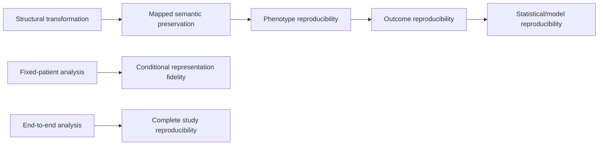

# 06 — Manuscript and review guide

This document tells collaborators what the current paper is arguing and where critical review is most useful.

## Working scientific question

> **When the same study is implemented independently in PCORnet and in a transformed OMOP database, which parts of the scientific result are reproducible, where can divergence enter, and what mechanism explains any difference?**

## Proposed conceptual contribution

The manuscript should emphasize that common-data-model validation is layered:

The key methodological point is that conditional fidelity and end-to-end reproducibility are not interchangeable.

## Main empirical story

1. The audited ETL produced explainable structural differences rather than unexplained row loss.
2. Mapped patient-level clinical semantics were preserved essentially exactly.
3. The original source-faithful ischemic-stroke phenotypes had substantially smaller OMOP cohorts because the source phenotype could use encounter-date fallback for diagnoses lacking `DX_DATE`, while the frozen ETL explicitly required `DX_DATE`.
4. When nonmissing diagnosis-date eligibility was imposed symmetrically, D0/D1/D3 phenotype membership and index dates were exactly reproduced.
5. When the same patients and index dates were held fixed, 30/90-day acute-care outcomes were exactly reproduced.
6. When each CDM built the study independently, 30/90-day risks differed because the analyzed populations differed upstream.
7. On the same fixed cohort, baseline features, logistic associations, and conventional logistic predictions were nearly identical.
8. End-to-end model performance differed because the training/evaluation populations differed.

## Strongest defensible conclusion

> **An audited PCORnet-to-OMOP conversion can preserve mapped clinical information and conditional analyses extremely well while an explicit upstream eligibility policy still changes cohort membership and propagates into end-to-end risks and model performance.**

## Claims to avoid

Do not write:

- “OMOP and PCORnet are equivalent.”
- “OMOP caused worse prediction.”
- “All cohort loss was an ETL error.”
- “The harmonized Stage C sensitivity replaces the original Stage C analysis.”
- “The original recurrent endpoint required recurrent `PDX=P`.”
- “The study proves general equivalence for other sites, phenotypes, outcomes, or ETL implementations.”

## What we want reviewers to challenge

Collaborators should actively challenge:

### Study-design clarity

- Is the fixed-cohort versus end-to-end distinction obvious?
- Are primary, sensitivity, and post-outcome analyses clearly labeled?
- Is the harmonized Stage C sensitivity framed as answering a fairness/causal-attribution question rather than erasing the original practical portability result?

### Causal interpretation

- Does the evidence support the stated mechanism for cohort divergence?
- Are we careful not to call deliberate ETL policy effects implementation defects?
- Are alternative explanations appropriately ruled out only where data support that conclusion?

### Clinical/statistical importance

- Do we explain why selective cohort loss can matter more than a small overall row-loss percentage?
- Do we explain that transformation problems can affect prevalence, treatment-effect estimates, confounding distributions, subgroup composition, time-to-event analyses, and prediction models?
- Are we clear that the seriousness of a transformation difference depends on which patients/events are lost, not only how many?

### Generalizability

- Is the single-site/single-dataset scope stated clearly?
- Are vocabulary limitations and the missing PROVIDER source table appropriately acknowledged?
- Do we avoid extrapolating the exact stroke result to unrelated phenotypes?

## Practical recommendations the paper can make

A researcher validating a CDM transformation should:

1. compare explicit eligibility rules between source and target implementations;
2. report source/target/intersection/source-only/target-only cohort counts;
3. compare index dates;
4. characterize **who is lost**, not only how many rows are lost;
5. compare important covariate distributions and missingness;
6. compare outcomes patient-by-patient among shared patients;
7. run both fixed-cohort and end-to-end analyses;
8. compare final estimands, confidence intervals, and model performance;
9. decompose discrepancies into ETL defect, ETL policy, CDM representation, vocabulary coverage, or analysis-definition causes;
10. preserve enough lineage to make that decomposition possible.

## Current manuscript source

The older integrated manuscript fragments are retained in `docs/archive/` for provenance. They should not be reviewed as separate competing drafts.

For new writing, use the numbered docs as the source of truth, especially:

- `02_STUDY_DESIGN_AND_DECISIONS.md` for methods/interpretation;
- `03_RESULTS_THROUGH_STAGE_E.md` for numbers;
- this file for framing and review questions.

A single journal-targeted manuscript should be created only after journal selection so that word limits, table limits, and supplement structure can be handled once rather than maintaining several parallel drafts.
