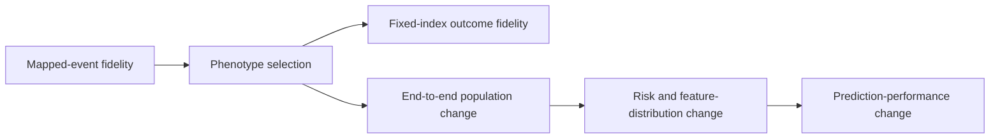

# 07 — Publication figures

This document defines the reproducible figure pipeline for the manuscript. The figures are not screenshots and are not manually edited after export: every panel is generated from versioned disclosure-reviewed aggregate values by Python code in this repository.

## Design objective

The figures are designed around the paper's central scientific distinction:

> **Conditional fidelity can be nearly exact when the same patients and index dates are held fixed, while an independently run end-to-end study can produce different cohorts and final estimates because an upstream eligibility rule changes who enters the analysis.**

The main figures therefore prioritize scientific mechanism and estimands rather than converting every results table into a plot.



## Current figure set

| Figure | Purpose | Manuscript role |
| --- | --- | --- |
| Figure 1 — validation framework | Shows the ETL, Stages A–E, and the fixed versus end-to-end estimands | Main |
| Figure 2 — phenotype reproducibility | Shows source-faithful discordance, exact harmonized sensitivity, and the `DX_DATE` mechanism | Main |
| Figure 3 — outcome reproducibility | Contrasts exact fixed-index risks with non-equivalent end-to-end risks and cohort sizes | Main |
| Figure 4 — model reproducibility | Shows feature SMDs, AUROC differences, patient-level prediction differences, and Brier differences | Main |
| Extended Data Fig. 1 — semantic fidelity | Separates exact mapped semantic fidelity from unresolved/concept-zero coverage limitations | Extended Data |
| Extended Data Fig. 2 — additional reproducibility | Shows fixed-cohort association ratios, probability correlations, and recurrent-stroke sensitivity | Extended Data |
| Extended Data Fig. 3 — calibration | Shows calibration slopes and intercepts under fixed and end-to-end estimands | Extended Data |

## Nature-oriented technical standard

The plotting defaults are aligned with the current Nature research-figure guidance checked on 2026-09-02:

- main figures: **89 mm** single-column or **183 mm** double-column width;
- Extended Data figures: maximum **180 mm** page width;
- maximum figure height: **170 mm**;
- body/axis/legend text: **5–7 pt** at final physical size;
- panel letters: **8 pt bold lowercase**;
- sans-serif font, preferably **Arial or Helvetica**;
- editable vector text, not outlined; Matplotlib PDF font type **42**;
- line/stroke widths enforced within **0.25–1 pt**;
- RGB, colour-vision-deficiency-friendly palette;
- no background gridlines, drop shadows, decorative effects, or coloured annotation text;
- axis lines, tick marks, labels, and units are retained;
- vector export for artwork plus a high-resolution raster preview.

Official references:

- https://research-figure-guide.nature.com/figures/preparing-figures-our-specifications/
- https://research-figure-guide.nature.com/figures/building-and-exporting-figure-panels/
- https://research-figure-guide.nature.com/figures/extended-data-formatting-guidelines/

The repository uses an Okabe–Ito colour-safe palette. Colour is never the only carrier of meaning: open/filled markers, labels, row names, and/or connecting lines also distinguish comparisons.

## Reproducibility architecture

Figure inputs are stored in:

`study_definitions/artifacts/publication_figure_data_v1.json`

This file contains **aggregate values only** and is intentionally versioned. It does not contain patient identifiers, row-level predictions, or protected health information. Scientific values used in the plots live in this versioned data artifact rather than being hard-coded into panel code.

Figure code is split into:

- `publication_figure_style.py` — typography, dimensions, colour palette, export and artwork validation;
- `publication_figure_panels_main.py` — Figures 1–4;
- `publication_figure_panels_extended.py` — Extended Data figures;
- `publication_figures.py` — command-line generation, scientific invariant checks, export, and manifest generation.

The figure runner verifies locked scientific invariants before rendering. For example, it fails if the harmonized Stage C phenotypes are not exactly concordant, if fixed Stage D events/risks are not identical, or if Stage B numeric reconciliation no longer sums correctly. Artwork validation also fails when final-size text or visible line weights fall outside the configured Nature ranges.

## Installation

```bash
python -m pip install -e '.[figures]'
```

For the full development environment:

```bash
python -m pip install -e '.[etl,analysis,figures,dev]'
```

## Generate the figures

Review-quality generation using the best available installed sans-serif font:

```bash
pcornet-omop-figures
```

Equivalent module invocation:

```bash
python -m pcornet_omop_validation.study.publication_figures
```

Default outputs are written to `figures/generated/` in:

- PDF — editable vector artwork for main-figure submission/authoring;
- EPS — vector artwork and an accepted Nature Extended Data format;
- SVG — convenient editable/review format;
- PNG — 600-dpi **review preview only**, not the intended Nature submission file.

Nature's current main-figure guidance prefers editable vector PDF/EPS/AI; its current Extended Data guidance accepts JPEG/TIFF/EPS and specifies a 180-mm maximum page width. For this all-vector figure set, use the generated **EPS** files for Extended Data submission rather than the PNG review previews.

Generated files are ignored by Git. The code and versioned aggregate inputs are the reproducible source of truth.

## Final-submission font check

Nature prefers Arial or Helvetica. Linux systems often do not include either by default. Review figures may therefore render with Nimbus Sans or Liberation Sans, but final submission artwork should be regenerated on a system with Arial or Helvetica available.

To enforce this rather than silently accepting a fallback:

```bash
pcornet-omop-figures --font Arial --strict-font
```

or:

```bash
pcornet-omop-figures --font Helvetica --strict-font
```

The repository does **not** distribute font files.

## Generate or verify selected figures

Validate the frozen aggregate input without producing graphics:

```bash
pcornet-omop-figures --verify-only
```

Generate one figure only:

```bash
pcornet-omop-figures --only Figure3_outcome_reproducibility
```

Change formats explicitly if needed:

```bash
pcornet-omop-figures --formats pdf,eps
```

## Manifest and audit trail

Each complete run writes:

`figures/generated/publication_figures_manifest.json`

The manifest records:

- frozen ETL SHA;
- figure-data SHA-256;
- Git SHA of the plotting code;
- Matplotlib version;
- actual font used;
- main and Extended Data size targets, typography and line-weight constraints;
- every generated filename, byte size, and SHA-256;
- aggregate-only status.

This allows a collaborator or reviewer to determine exactly which code/data/font/software generated a submitted figure.

## Figure-specific interpretation guardrails

**Figure 2:** the harmonized `DX_DATE` result is a post-freeze sensitivity. It demonstrates residual representation concordance after symmetric eligibility; it does not replace the source-faithful primary phenotype result.

**Figure 3:** shaded areas are the prespecified Stage D equivalence margins (absolute risk difference ±0.5 percentage points; risk ratio 0.95–1.05). The fixed and end-to-end rows answer different scientific questions.

**Figure 4:** the dashed line in panel a marks the prespecified Stage E negligible SMD threshold of 0.10. End-to-end prediction differences combine cohort selection and feature-distribution differences; they are not a pure intrinsic OMOP model effect.

**Extended Data Fig. 1:** exact mapped semantic agreement and vocabulary/coverage limitations are deliberately shown separately. A concept-zero or unresolved route is not counted as a mapped-event disagreement.

**Extended Data Fig. 3:** ideal calibration is slope = 1 and intercept = 0. Calibration differences are descriptive reproducibility results; no calibration-equivalence margin was prespecified for Stage E v1.

## Recommended manuscript use

Keep Figures 1–4 in the main text unless a target journal has a stricter display-item limit. Extended Data figures should carry technical validation detail so the main narrative remains readable.

Do not manually reposition points, alter scales, change values, or edit labels in Illustrator/PowerPoint after export. If a figure needs revision, change the Python code or versioned aggregate input, regenerate it, and retain the new manifest.
