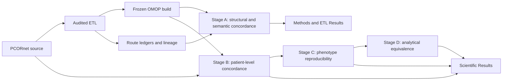
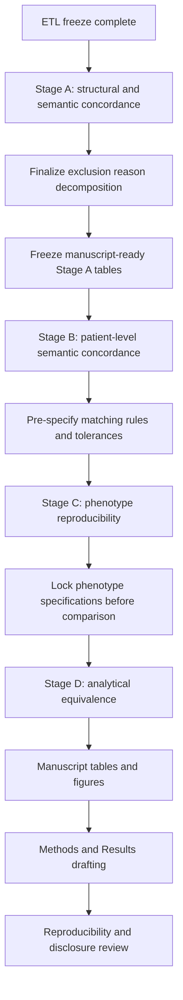
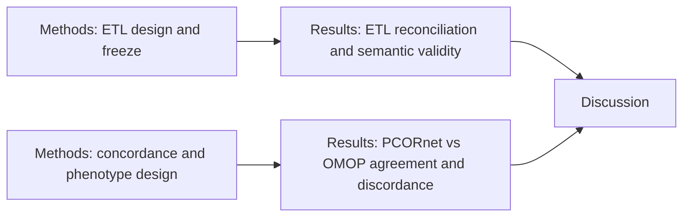

# Project history, decisions, findings, and publication roadmap

_Last updated: 2026-08-27_

## Why this document exists

This is the durable project record for the PCORnet-to-OMOP validation study. It summarizes what changed, why it changed, what the frozen ETL demonstrated, what Stage A has found so far, and how the remaining publication analyses are intended to proceed.

The key methodological principle is that PCORnet-versus-OMOP differences should be interpreted only after separating intrinsic CDM representation differences from defects or arbitrary choices in the ETL implementation.

## Project evolution

The project began as a comparison of PCORnet and OMOP representations. Early review of the historical converter showed that implementation defects could contaminate that comparison. The project therefore pivoted first to building and validating a defensible PCORnet-to-OMOP ETL, then freezing that ETL before performing the scientific comparison.

The resulting design is:

## Historical converter issues that motivated the redesign

The historical conversion path contained or had previously contained defects that could not be treated as intrinsic CDM differences, including duplicated PRESCRIBING behavior, missing VITAL handling, omitted CONDITION/IMMUNIZATION pathways, sentinel dates for missing required dates, and incomplete source coverage. The audited ETL was therefore designed independently around source semantics and OMOP vocabulary rules rather than around reproducing the historical OMOP database.

## Core ETL decisions

The following decisions are frozen methodological choices unless a new independently demonstrated implementation defect is found.

1. **The prior/comparator OMOP database is not an ETL acceptance target.** It is preserved only for later scientific comparison.
2. **Row-count equality is not required between CDMs.** One-to-many Standard mappings and cross-domain routing can legitimately expand or redistribute rows.
3. **Required dates are not invented.** Records missing required dates are excluded and quantified rather than assigned sentinel dates.
4. **Exact source mappings may not choose an arbitrary candidate.** Ambiguous source concepts or ambiguous Standard targets remain unresolved rather than using `TOP(1)` or lowest-concept selection.
5. **Nonzero standardized concepts must be vocabulary-valid.** Where field semantics imply an expected OMOP domain, nonzero concepts must be active Standard concepts in that domain.
6. **Concept `0` is an acceptable explicit result when the source does not justify a unique Standard concept.** Source values and route provenance are retained so unresolved mappings remain auditable.
7. **Cross-domain mappings are materialized according to Standard vocabulary semantics.** A PCORnet PROCEDURES or CONDITION record may legitimately become an OMOP Measurement, Observation, Drug, Device, Specimen, Condition, or Procedure event.
8. **Non-event semantic targets are retained in routing ledgers instead of becoming false standalone clinical events.** Examples include Unit, Meas Value, Route, Provider, Type Concept, and Spec Anatomic Site targets when they are semantic components rather than event domains.
9. **`Maps to value` does not independently create an event.** Event routes are determined from event-domain Standard targets; non-event targets remain contextual semantics.
10. **Downstream concordance results do not retune the ETL.** After freeze, analysis findings may motivate investigation, but mapping changes require an independently demonstrated ETL defect and a documented new freeze.

## Final publication ETL freeze

The publication ETL freeze is anchored to:

`887e6f4d60a6b185e58b3c9fe8887472b49777e3`

A guarded reset was performed against the isolated validated target, followed by a complete 14-phase rebuild from zero. The comparator database was not modified.

Final freeze acceptance:

- global reconciliation: matched;
- visit-time semantics: matched;
- materialized visit datetime mismatches: 0;
- duplicate primary-key groups: 0;
- reversed audited intervals: 0;
- semantic hard blockers: 0;
- semantic review flags: 10;
- explained review flags: 10;
- unexplained review flags: 0;
- auxiliary concept blockers: 0;
- final manifest worktree entries: 0.

The remaining semantic review flags are documented provenance/concept-0 decisions rather than hidden reconciliation failures.

## Final frozen OMOP counts

| OMOP table | Rows |
| --- | ---: |
| person | 27,089 |
| observation_period | 27,087 |
| visit_occurrence | 1,510,957 |
| condition_occurrence | 7,315,572 |
| procedure_occurrence | 4,182,803 |
| measurement | 85,715,435 |
| observation | 7,319,081 |
| drug_exposure | 48,458,058 |
| device_exposure | 196,660 |
| specimen | 93 |
| death | 6,955 |

These are recorded outputs, not thresholds that future data must reproduce.

## Major domain-specific outcomes

### Person

Gender, race, and ethnicity mappings are validated against the loaded vocabulary. Deprecated/non-Standard candidates are rejected to concept `0` while source values are preserved.

### Visit occurrence

Encounter-type mapping is conservative. Numeric admit/discharge times were empirically validated as SAS seconds within a day, and the frozen build produced zero materialized datetime mismatches.

### Procedure

PROCEDURES are routed through a canonical ledger supporting direct Standard concepts, `Maps to`, one-to-many expansion, unresolved fallback, cross-domain event routing, and non-event semantic components.

### OBS_CLIN

OBS_CLIN is routed by validated Standard concept domain to Measurement, Observation, or Condition. Unresolved rows are retained as Observation concept `0` rather than being forced into Measurement.

### Condition

DIAGNOSIS and CONDITION share a canonical route model supporting multi-target `Maps to` semantics. Events with no event-domain Standard target receive a Condition concept-0 fallback so the source event remains represented and auditable.

### Measurement

LAB, VITAL, Procedure-derived Measurement, and OBS_CLIN Measurement are reconciled through lineage. LOINC/UCUM handling is source-derived; exact UCUM matching is case-sensitive.

### Drug

PRESCRIBING, DISPENSING, MED_ADMIN, IMMUNIZATION, and Procedure-derived Drug routes are represented through a single route ledger. RxNorm and NDC routing supports one-to-many mappings, while unresolved drug concepts and unresolved route concepts remain explicit.

### Death

Death uses no invented sentinel dates. The frozen source had no DEATH_CAUSE rows; death type/cause concept `0` is an explicit provenance policy.

## Stage A: structural and semantic concordance

Publication analysis proceeds on branch `publication/analysis`, which starts from the frozen ETL commit. Stage A is read-only with respect to ETL semantics.

Stage A currently generates:

- final OMOP target counts;
- source eligibility/exclusion summaries;
- source-to-route-to-target reconciliation summaries;
- concept-0 summaries;
- visit/unit/route coverage summaries;
- cross-domain routing summaries;
- Procedure disposition and target-domain tables;
- Condition canonical-route tables;
- OBS_CLIN routing tables;
- mapping-mechanism summaries;
- manuscript-oriented Markdown tables.

### Stage A findings so far

#### PROCEDURES

- source rows: 11,244,947;
- eligible events: 11,228,023;
- excluded: 16,924;
- route rows: 11,234,863;
- one-to-many expansion: 6,840 additional rows;
- event-route rows: 11,121,561;
- unresolved route rows: 111,660;
- non-event semantic-component rows: 1,642.

The route ledger shows that one PCORnet procedure can legitimately map to more than one Standard OMOP target and/or more than one target domain.

#### OBS_CLIN

Of 38,850,928 eligible records:

- Measurement: 37,327,978 (about 96.08%);
- Observation: 1,483,835 total, including 12,737 unresolved concept-0 rows;
- Condition: 39,115;
- unresolved fraction: about 0.033% of eligible OBS_CLIN records.

This is strong evidence that OBS_CLIN cannot be modeled as a single fixed OMOP table without losing vocabulary-domain semantics.

#### DIAGNOSIS + CONDITION

- eligible source events: 8,674,973;
- canonical route rows: 9,045,157;
- core event-route rows: 9,043,769;
- non-event Standard route rows: 1,388;
- Condition concept-0 fallback rows: 60,148;
- source events with multiple core event routes: 361,606.

Approximately 4.17% of eligible source events generate more than one core OMOP event route. Approximately 0.69% require an explicit Condition concept-0 fallback.

#### Drug

- route rows / Drug Exposure rows before Condition cross-domain append: 48,457,880;
- drug concept-0 rows: 17,469,480 (about 36.05%);
- standardized route-source rows: 46,725,342;
- mapped Route concept rows: 18,346,905;
- standardized nonblank route values remaining Route concept `0`: 28,378,437.

The large unresolved Drug fraction is therefore a substantive representation/mapping-coverage finding, not a target-reconciliation failure.

## Current Stage A caution

The current source eligibility table correctly reports total eligible/excluded counts, but exclusion reasons still need finer decomposition before the table is considered manuscript-ready. In particular:

- DIAGNOSIS currently reports the aggregate difference between raw source rows and the canonical eligible population; exact exclusion reasons should be broken out explicitly.
- PROCEDURES should distinguish the exact frozen exclusion causes rather than relying only on the combined eligibility predicate description.

This is the immediate remaining Stage A cleanup item.

## Publication plan

### Stage A — structural and semantic concordance

Goal: quantify preservation, expansion, exclusion, unresolved mappings, one-to-many routes, cross-domain routes, concept-0 burden, visit linkage, and vocabulary coverage.

Immediate remaining tasks:

- decompose exclusions by explicit rule;
- review aggregate outputs for internal consistency and disclosure risk;
- freeze publication-safe Stage A tables/figure inputs;
- draft ETL-validation and Stage A Results text from scripted outputs only.

### Stage B — patient-level semantic concordance

Goal: compare equivalent clinical content at patient/event level between source PCORnet and frozen OMOP.

Before running comparisons, lock per-domain rules for patient linkage, event matching, concept handling, time tolerance, one-to-many routes, cross-domain routes, and concept `0`.

Planned metrics include prevalence difference, intersection/union, Jaccard similarity, positive agreement, event-count differences, temporal agreement, and discordance decomposition by ETL route reason.

### Stage C — phenotype reproducibility

Goal: implement selected phenotypes independently in both CDMs and compare cohort membership.

The first phenotype family is expected to use the existing stroke-oriented study modules, but the phenotype specification must be locked before viewing PCORnet-versus-OMOP disagreement cases.

Planned outputs include cohort size, shared patients, PCORnet-only patients, OMOP-only patients, Jaccard similarity, positive agreement, and classified discordance reasons.

### Stage D — analytical equivalence

Goal: assess whether scientific conclusions remain stable despite representation differences.

Analyses must use matched pre-specified definitions for cohort, index date, covariates, outcomes, censoring, follow-up, missing-data policy, and model specification. Comparison should focus on effect estimates and uncertainty rather than only p-value thresholds.

## Manuscript structure

The manuscript should deliberately separate ETL validity from scientific concordance:

Suggested manuscript organization:

1. Introduction: why CDM transformation effects are difficult to separate from ETL defects.
2. Methods — data sources and CDMs.
3. Methods — audited ETL, vocabulary policy, lineage, reconciliation, and freeze protocol.
4. Results — frozen ETL validation and Stage A structural/semantic findings.
5. Methods — patient-level concordance and phenotype/analytic study design.
6. Results — Stages B-D.
7. Discussion — which differences reflect ETL/vocabulary coverage, which reflect intrinsic representation choices, and which affect downstream conclusions.
8. Reproducibility/data-governance statement.

## Reproducibility requirements

Every publication analysis run should record:

- frozen ETL SHA;
- analysis-code SHA;
- configuration hash with secrets excluded;
- study-definition/version;
- database/schema identifiers;
- input audit/freeze-manifest hashes;
- run timestamp;
- output filenames and hashes where appropriate;
- enough aggregate counts to regenerate manuscript tables/figures.

Row-level data remain outside Git. Publication-safe aggregate outputs may be committed only after disclosure review.

## Decision-log rule going forward

Any change to a phenotype, matching rule, concordance definition, code list, statistical model, or ETL after inspecting downstream results must be recorded with:

- what changed;
- why it changed;
- whether it corrected an independently demonstrated bug, implemented a pre-specified sensitivity analysis, or was prompted by observed disagreement;
- which analyses were rerun;
- whether the frozen ETL SHA changed.

This rule is intended to prevent post hoc optimization toward agreement.
