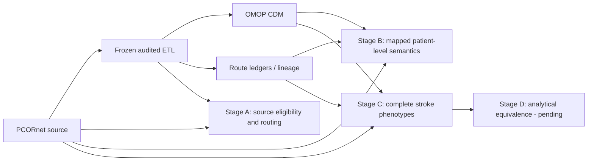
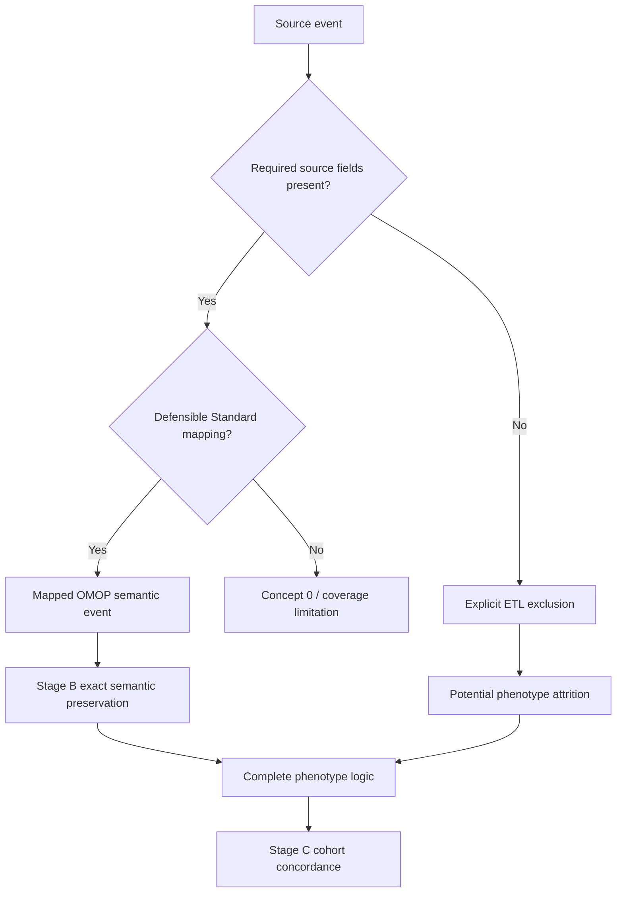
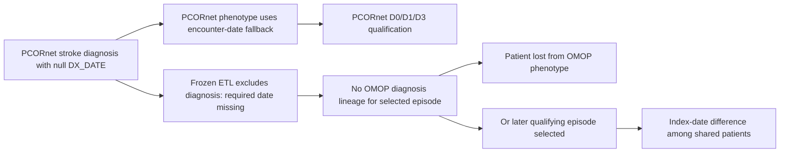

# Integrated manuscript draft through Stage C

Frozen ETL SHA: `887e6f4d60a6b185e58b3c9fe8887472b49777e3`

This document integrates the completed Stage A structural validation, locked Stage B patient-level semantic concordance, and completed Stage C ischemic-stroke phenotype reproducibility analyses. It is a manuscript-oriented synthesis of observed outputs. It does not redefine the frozen ETL or any prespecified Stage B/C estimand. Stage D analytical-equivalence results remain pending and are marked explicitly as placeholders.

## Working title

**From PCORnet to OMOP: separating transformation fidelity, semantic preservation, and phenotype reproducibility in an audited common-data-model conversion**

## Study objective

We evaluated whether clinical information represented in a PCORnet common data model was preserved after conversion to OMOP CDM v5.4.2. Rather than treating raw row-count equality as the validation target, we separated four questions: (1) whether the ETL represented source records according to explicit eligibility and vocabulary rules; (2) whether mapped patient-level clinical semantics were preserved; (3) whether complete computable phenotypes were reproducible; and (4) whether downstream analytical estimates were equivalent. The first three questions are complete in Stages A-C. Stage D will address analytical equivalence.

# Methods

## Study design and analysis freeze

We performed a staged validation of an audited PCORnet-to-OMOP transformation. The publication ETL was frozen before patient-level concordance and phenotype analyses at Git commit `887e6f4d60a6b185e58b3c9fe8887472b49777e3`. Publication analyses were executed separately on the `publication/analysis` branch. Downstream discordance findings were not used to retune the frozen ETL.

The ETL targeted OMOP CDM v5.4.2 and used a frozen Athena vocabulary. Source records were retained with concept `0` when no defensible unique active Standard concept was available. One-to-many Standard mappings and cross-domain mappings were preserved. Records missing required dates were excluded rather than assigned sentinel dates. Non-event semantic components were retained in route ledgers rather than materialized as false standalone clinical events.

Patient linkage for downstream analyses used the source-derived bridge from PCORnet `PATID` to OMOP `person.person_source_value`, with uniqueness required before concordance analysis.

## Stage A: structural and semantic representation

Stage A characterized source eligibility, exclusions, routing, vocabulary coverage, cross-domain transformation, one-to-many expansion, and final OMOP target counts. Source and route ledgers were reconciled without using a historical OMOP comparator as an acceptance target. Raw PCORnet-to-OMOP row-count equality was not required where one source event could validly map to multiple Standard concepts or to a different OMOP domain.

The main descriptive outcomes were source rows, eligible rows, explicit exclusion reasons, route counts, concept-zero counts, target-domain distributions, and mapping mechanisms.

## Stage B: patient-level semantic concordance

Stage B evaluated patient-level semantic preservation after the ETL freeze. Wave 1 examined Encounter, Death, Condition, and Procedure. Wave 2 examined Drug and Measurement/Observation semantics. Primary comparisons were based on native CDM representations rather than target lineage.

Encounter and Death used patient/date identity. Condition and Procedure used patient, date, target domain, and Standard concept, preserving one-to-many and cross-domain routes. Drug used patient, start date, and Standard Drug concept. Measurement/Observation used patient, calendar date, target domain, and Standard concept.

Concept-zero rows were excluded from mapped-agreement denominators and reported separately as vocabulary or policy coverage. Additional OMOP rows occupying the same source-defined Standard concept space were not classified as transformation error until secondary lineage attribution determined whether they arose from other audited PCORnet source families.

Secondary value analyses compared numeric values, resolved UCUM units, and prespecified categorical value concepts. No post-hoc numeric tolerance was introduced. VITAL numeric discrepancies were subsequently evaluated against the frozen SQL expression itself to distinguish deterministic coercion/representation effects from unexplained target divergence.

## Stage C: ischemic-stroke phenotype reproducibility

Stage C evaluated complete patient-level ischemic-stroke phenotypes using a locked source-reference definition and two OMOP estimands.

The **primary transformation-fidelity estimand** used lineage-faithful OMOP representation so that source-only semantics such as PCORnet primary-diagnosis status could be preserved through frozen lineage while phenotype windows were applied to dates actually materialized in OMOP. The **secondary native-OMOP portability estimand** used active Standard concepts only and intentionally did not reconstruct PCORnet `PDX`, which has no native OMOP core equivalent.

D0 identified adults with a qualifying inpatient, emergency, or emergency-to-inpatient stroke encounter under the locked study definition and selected the earliest qualifying index event per patient. D1 added qualifying CT or MRI imaging and lipid testing. D3 added MRI and lipid testing. D1 imaging used 3 CT and 6 MRI CPT codes; D3 used the 6 MRI codes. The source-reference lipid phenotype used the exact locked 214-LOINC whitelist. In the frozen vocabulary, 192 of 214 LOINCs resolved to active Standard Measurement/Observation targets; the remaining 22 were reported as native-portability coverage limitations rather than removed or silently remapped. `SPECIMEN_DATE` was the selected source lipid date according to the prespecified date-field priority.

Stage C D1/D3 definitions and evidence windows were frozen before the first completed outcome query. A pre-outcome runtime intervention added analysis-only nonclustered SQL indexes without changing rows, mappings, dates, lineage, phenotype criteria, or ETL logic.

Post-outcome mechanism audits were performed only after the primary D1/D3 concordance was complete. These audits were explicitly explanatory and did not alter the frozen ETL, phenotype definitions, or primary estimands. They examined why source-only patients were lost and why a small fraction of shared patients had different selected index dates.

## Reproducibility and disclosure

All final manuscript-oriented outputs were generated from aggregate analysis artifacts anchored to the frozen ETL SHA and versioned study definitions. Aggregate bundles write no patient identifiers, source-record identifiers, row-level protected health information, or free-text clinical values.

# Results

## Stage A: explicit transformation rules explain structural differences

The frozen OMOP build contained 27,089 persons, 27,087 observation periods, 1,510,957 visits, 7,315,572 condition occurrences, 4,182,803 procedure occurrences, 85,715,435 measurements, 7,319,081 observations, 48,458,058 drug exposures, 196,660 device exposures, 93 specimens, and 6,955 deaths.

Source exclusions were concentrated in required-date fields. Of 11,484,577 PCORnet DIAGNOSIS rows, 8,024,792 were eligible and 3,459,785 (30.125%) were excluded because `DX_DATE` was missing. No other diagnosis eligibility mechanism contributed to those exclusions. Of 11,244,947 PROCEDURES rows, 16,924 (0.151%) were excluded because `PX_DATE` was missing. Other major source families had no required-date exclusions.

One-to-many and cross-domain routing produced expected differences between source-event and OMOP-row counts. Among 11,228,023 eligible PROCEDURES events, the route ledger contained 11,234,863 rows because valid one-to-many mappings were retained. A total of 11,121,561 routes represented clinical events, 111,660 were unresolved, and 1,642 were non-event semantic components. Procedure source records mapped across Procedure, Measurement, Observation, Drug, Device, Condition, and Specimen domains.

DIAGNOSIS and CONDITION jointly contributed 8,674,973 eligible source events and 9,045,157 canonical route rows. Among these, 361,606 source events produced more than one core event route and 60,148 required explicit Condition concept-zero fallback. All 38,850,928 OBS_CLIN records entered the routing ledger; 37,327,978 routed to Measurement, 1,471,098 to Observation, 39,115 to Condition, and 12,737 remained unresolved as Observation concept `0`.

Drug mapping coverage was lower than event-preservation coverage. The Drug route ledger contained 48,457,880 rows, of which 17,469,480 (36.05%) had `drug_concept_id = 0`. These rows were treated as vocabulary/source-code coverage limitations rather than transformation reconciliation failures.

## Stage B: mapped clinical semantics were preserved exactly

Encounter and Death were exactly concordant. All 1,510,957 Encounter events and all 6,955 Death events matched by patient and date with no unmatched events and patient Jaccard 1.0.

For Condition semantics, all 8,983,621 mapped source routes were present exactly in native OMOP under the prespecified patient/date/domain/concept identity. OMOP contained 9,739,734 rows in the same source-defined concept space. The 756,113-row excess was completely explained by other audited PCORnet source provenance. Patient Jaccard before provenance attribution was 0.970668. Separately, 60,148 unresolved Condition concept-zero rows were reported as mapping coverage.

For Procedure semantics, all 11,121,561 mapped source routes matched exactly. OMOP contained 12,659,204 rows in the corresponding concept space; the 1,537,643-row excess was fully attributable to other audited source provenance. Patient Jaccard before attribution was 0.995457. There were 111,660 unresolved routes and 1,642 non-event semantic components reported separately.

For Drug semantics, all 30,988,400 mapped nonzero Standard Drug routes matched exactly in OMOP, with patient Jaccard 1.0. The target contained 48 additional rows in the same concept space, all explained by other audited provenance. The much larger 17,469,480 concept-zero population represented source/vocabulary mapping coverage rather than mapped-event discordance.

Measurement/Observation showed exact semantic-presence concordance. All 92,668,145 mapped source semantic rows were found exactly in OMOP, with zero source-unmatched rows, zero target-unmatched rows, and patient Jaccard 1.0. Separately, 366,371 unresolved or descriptive concept-zero rows were excluded from the mapped semantic denominator.

Across 75,769,622 directly comparable numeric rows, 75,644,000 matched the direct-source expression exactly. All 125,622 direct-source differences occurred in VITAL measurements. Reproducing the frozen ETL SQL expansion explained all 125,622 differences, leaving zero unexplained target mismatches. Among 58,916,347 uniquely resolved active Standard UCUM unit rows, agreement was 100%. Among 809,630 prespecified mapped categorical value concepts, agreement was also 100%.

## Stage C: phenotype discordance was dominated by a diagnosis-date ETL rule

The locked source-reference D0 cohort contained 9,815 patients and the lineage-faithful OMOP D0 cohort contained 6,001. All 6,001 shared patients had the same index date; 3,814 patients were source-only and none were OMOP-only. All source-only D0 patients were attributed to the interaction between source phenotype date fallback and the frozen required-date ETL policy.

For D1, the source-reference cohort contained 8,624 patients and the lineage-faithful OMOP cohort contained 5,246. There were 5,245 shared patients, 3,379 source-only patients, and 1 OMOP-only patient, yielding patient Jaccard 0.6081 and positive agreement 75.63%. Among shared patients, 5,108 (97.39%) had exactly matching selected index dates.

For D3, the source-reference cohort contained 7,565 patients and the lineage-faithful OMOP cohort contained 4,710. There were 4,709 shared patients, 2,856 source-only patients, and 1 OMOP-only patient, yielding patient Jaccard 0.6224 and positive agreement 76.73%. Among shared patients, 4,592 (97.52%) had exactly matching selected index dates.

The post-outcome source-only mechanism audit reproduced the completed D1/D3 concordance counts exactly. All 3,379 D1 source-only patients and all 2,856 D3 source-only patients had a null selected `DX_DATE`, lacked a diagnosis xwalk, and lacked the corresponding lineage base. No source-only patient was explained by a missing visit xwalk or by loss of a condition row after an existing diagnosis xwalk.

The post-outcome index-date audit also reproduced the completed concordance. All 137 D1 shared patients with different index dates and all 117 D3 shared patients with different index dates were classified as selection of a different qualifying episode because the source-selected diagnosis had null `DX_DATE` and lacked OMOP diagnosis lineage. No residual shared-date mismatch was attributed to a same-encounter date representation difference.

Thus, adding imaging and lipid requirements did not create progressive degradation in cross-CDM phenotype concordance. Jaccard similarity remained approximately 0.61-0.62 across D0, D1, and D3. The dominant loss mechanism occurred upstream at diagnosis materialization under the frozen required-date policy rather than in imaging or lipid transformation.

The secondary native-OMOP portability cohorts were larger than the lineage-faithful cohorts for D0-D3 because native OMOP cannot directly reproduce PCORnet `PDX` and because portability was evaluated using Standard concepts rather than source lineage. Native-OMOP patient Jaccard values were 0.565 for D0, 0.583 for D1, and 0.601 for D3. These values are reported as portability sensitivities and not as the primary transformation-fidelity estimand.

# Integrated interpretation

The staged validation distinguishes three different forms of apparent CDM discordance.

First, **structural differences** can be expected consequences of explicit ETL rules. Required-date exclusions, one-to-many Standard mappings, cross-domain routing, and concept-zero retention prevent raw row-count equality from serving as a valid general fidelity criterion.

Second, **mapped semantic preservation** can be excellent even when vocabulary coverage is incomplete. In Stage B, every mapped source event or semantic route in the prespecified denominators was found in OMOP. The major remaining limitations were concept-zero coverage, unresolved units, unsupported categorical values, and additional valid OMOP rows contributed by other source families.

Third, **complete phenotype reproducibility** is sensitive to source-model semantics and ETL eligibility rules even when mapped events are otherwise preserved. The stroke analyses demonstrate this directly: a single required-date transformation policy removed source diagnoses that the PCORnet phenotype could still use through encounter-date fallback. That upstream loss accounted for all D1/D3 source-only patients and all residual shared-patient index-date differences.

These findings support evaluating CDM conversion through layered estimands rather than a single global concordance number. Structural reconciliation asks whether the transformation followed explicit rules. Semantic concordance asks whether mapped clinical meaning was preserved. Phenotype reproducibility asks whether the combination of representation, source-specific semantics, eligibility rules, and temporal logic yields the same patient cohort. These questions are related but not interchangeable.

# Limitations to retain in the manuscript

1. This study evaluates one source dataset and one audited PCORnet-to-OMOP implementation; generalizability to other sites, PCORnet implementations, and vocabulary releases remains to be established.
2. Native OMOP cannot reproduce all source-model semantics. PCORnet `PDX` is a key example, so native-portability analyses should not be interpreted as direct ETL-fidelity tests.
3. Vocabulary coverage remains incomplete for some drug codes, units, categorical values, and 22 of the 214 locked lipid LOINCs in the frozen vocabulary.
4. The D1/D3 source-only and index-date mechanism audits were designed after observing the primary concordance and therefore are explanatory, not prespecified confirmatory analyses.
5. Stage D analytical equivalence is not yet complete. The manuscript should not claim equivalence of downstream effect estimates until those analyses are executed and locked.

# Proposed main tables

## Table 1. Structural representation and explicit exclusions

| Source family / layer | Source or denominator | Eligible / represented | Excluded or unresolved | Main interpretation |
| --- | ---: | ---: | ---: | --- |
| DIAGNOSIS | 11,484,577 | 8,024,792 | 3,459,785 | All exclusions due to missing `DX_DATE`. |
| PROCEDURES | 11,244,947 | 11,228,023 | 16,924 | Missing `PX_DATE`. |
| OBS_CLIN | 38,850,928 | 38,850,928 | 12,737 concept-zero routes | Cross-domain routing with very low unresolved fraction. |
| Drug route ledger | 48,457,880 | 30,988,400 mapped Standard Drug routes | 17,469,480 concept-zero | Mapping coverage limitation, not mapped-event loss. |
| Condition canonical routes | 9,045,157 routes | source semantics retained | 60,148 concept-zero fallback | One-to-many and cross-domain mappings preserved. |

## Table 2. Stage B patient-level semantic concordance

| Semantic family | Source mapped rows | Exact matched | Source unmatched | Target rows in source-defined semantic space | Other provenance | Patient Jaccard |
| --- | ---: | ---: | ---: | ---: | ---: | ---: |
| Encounter | 1,510,957 | 1,510,957 | 0 | 1,510,957 | 0 | 1.000000 |
| Death | 6,955 | 6,955 | 0 | 6,955 | 0 | 1.000000 |
| Condition | 8,983,621 | 8,983,621 | 0 | 9,739,734 | 756,113 | 0.970668 |
| Procedure | 11,121,561 | 11,121,561 | 0 | 12,659,204 | 1,537,643 | 0.995457 |
| Drug | 30,988,400 | 30,988,400 | 0 | 30,988,448 | 48 | 1.000000 |
| Measurement/Observation | 92,668,145 | 92,668,145 | 0 | 92,668,145 | 0 | 1.000000 |

## Table 3. Stage C stroke phenotype reproducibility

| Phenotype | PCORnet | Lineage-faithful OMOP | Shared | PCORnet only | OMOP only | Jaccard | Exact shared index date | Native OMOP Jaccard |
| --- | ---: | ---: | ---: | ---: | ---: | ---: | ---: | ---: |
| D0 | 9,815 | 6,001 | 6,001 | 3,814 | 0 | 0.611 | 100.00% | 0.565 |
| D1 | 8,624 | 5,246 | 5,245 | 3,379 | 1 | 0.608 | 97.39% | 0.583 |
| D3 | 7,565 | 4,710 | 4,709 | 2,856 | 1 | 0.622 | 97.52% | 0.601 |

## Table 4. Stage C D1/D3 discordance mechanism

| Phenotype | Source only | Null selected `DX_DATE` | Missing diagnosis xwalk | Visit xwalk missing | Shared index-date mismatches | Mismatches due to different episode after null-`DX_DATE` lineage loss |
| --- | ---: | ---: | ---: | ---: | ---: | ---: |
| D1 | 3,379 | 3,379 | 3,379 | 0 | 137 | 137 |
| D3 | 2,856 | 2,856 | 2,856 | 0 | 117 | 117 |

# Proposed figures

## Figure 1. Layered validation framework

**Figure message:** Validation progresses from transformation rules to mapped semantic preservation to complete phenotype reproducibility and finally analytical equivalence. A failure at one layer should not automatically be attributed to another.

## Figure 2. Where apparent discordance enters

**Figure message:** The stroke phenotype discordance arose primarily before semantic event comparison, at required-date eligibility, while mapped events themselves showed exact Stage B preservation.

## Figure 3. Stroke phenotype mechanism

**Figure message:** The same frozen diagnosis-date policy explains both cohort attrition and all residual D1/D3 shared-patient index-date discordance.

# Stage D placeholder

Do not populate this section until analytical-equivalence analyses are executed under a separately frozen Stage D analysis definition.

Suggested eventual outcomes may include matched cohort summary estimates, regression coefficients, risk differences/ratios, survival estimates, or other prespecified analyses. Stage D should compare downstream estimates rather than reuse event-level or cohort-level Jaccard as an analytical-equivalence metric.

# Suggested abstract results paragraph through Stage C

In structural validation, the main source exclusions were 3,459,785 diagnoses missing `DX_DATE` and 16,924 procedures missing `PX_DATE`; one-to-many and cross-domain vocabulary routes were preserved rather than forced into one-to-one row correspondence. In patient-level semantic validation, all mapped Encounter, Death, Condition, Procedure, Drug, and Measurement/Observation events or routes in the prespecified denominators were found in OMOP, with target-side excess for Condition and Procedure fully explained by alternate audited source provenance. Resolved numeric, unit, and categorical semantics showed no unexplained residual discordance. In ischemic-stroke phenotype validation, patient Jaccard was 0.611 for D0, 0.608 for D1, and 0.622 for D3. Post-outcome mechanism audits showed that all 3,379 D1 and 2,856 D3 source-only patients had null selected `DX_DATE` and lacked diagnosis lineage under the frozen required-date policy. Among shared D1/D3 patients, 97.39% and 97.52%, respectively, had exact selected index dates; every residual index-date difference was explained by selection of another qualifying episode after loss of the source-selected diagnosis.

# Suggested conclusion through Stage C

An audited PCORnet-to-OMOP conversion can preserve mapped clinical semantics exactly while still producing substantial differences in complete phenotype cohorts when source-model semantics interact with ETL eligibility rules. In this dataset, the dominant stroke-phenotype discordance arose from a required diagnosis-date transformation policy rather than from imaging, laboratory, or mapped event loss. These findings support layered validation that distinguishes structural transformation, vocabulary coverage, mapped semantic preservation, native-model portability, and complete phenotype reproducibility before assessing downstream analytical equivalence.
