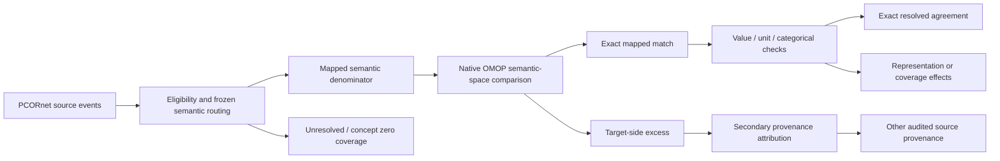

# Publication draft: Stage B patient-level semantic concordance

Frozen ETL SHA: `887e6f4d60a6b185e58b3c9fe8887472b49777e3`

This document is a manuscript-oriented synthesis of the two locked Stage B analysis waves. It is downstream of the ETL freeze and does not redefine the prespecified comparison rules. Counts below are observed outputs, not acceptance thresholds.

## Suggested Methods text

### Patient linkage and analysis freeze

Patient-level concordance was evaluated only after the audited PCORnet-to-OMOP transformation had been frozen. The frozen ETL version was identified by Git commit `887e6f4d60a6b185e58b3c9fe8887472b49777e3`. All Stage B analyses were executed on the separate `publication/analysis` branch, and downstream findings were not used to retune ETL mappings. PCORnet patients were linked to OMOP persons through the source-derived bridge from `PATID` to `person.person_source_value`, which was required to be unique before concordance analysis.

### Prespecified semantic comparison

Stage B was split into two prespecified analysis waves. Wave 1 evaluated Encounter, Death, Condition, and Procedure semantics under `study_definitions/stage_b_v1.json`. Wave 2 evaluated Drug and Measurement/Observation semantics under `study_definitions/stage_b_wave2_v1.json`. For mapped semantic comparisons, concept-zero rows were excluded from the mapped agreement denominator and reported separately as unresolved or policy-zero coverage. One-to-many mappings and cross-domain Standard mappings were retained rather than collapsed.

Primary comparisons were defined using native CDM representations rather than target lineage. Encounter and Death used patient/date event identity. Condition and Procedure used patient, date, target domain, and Standard concept, preserving one-to-many and cross-domain routes. Drug used patient, start date, and Standard Drug concept. Measurement/Observation used patient, calendar date, target domain, and Standard concept. Target lineage was applied only after the primary comparison to attribute additional native OMOP rows occupying the same semantic concept space.

### Value, unit, and categorical comparisons

Secondary Wave 2 analyses evaluated value preservation after semantic-presence concordance. Directly comparable numeric LAB and OBS_CLIN values were compared exactly to stored OMOP numeric values without a post-hoc tolerance. VITAL numeric values were first compared to direct native-field conversion and then, after observing a discrepancy pattern, through a prespecified diagnostic that reproduced the frozen ETL's exact SQL `CROSS APPLY (VALUES ...)` expression to distinguish deterministic representation effects from unexplained target divergence. Unit comparison was restricted to unique active Standard UCUM concepts resolved under the same case-sensitive policy used by the frozen ETL. Categorical agreement was restricted to prespecified exact Standard mappings for supported VITAL fields; unsupported values remained concept zero by policy.

### Coverage and provenance interpretation

Mapped semantic agreement and vocabulary coverage were reported separately. Concept-zero Drug routes, unresolved UCUM strings, unsupported categorical values, and unresolved/descriptive Measurement/Observation concept-zero rows were treated as coverage limitations rather than mapped-event discordance. Additional native OMOP rows in a source-defined Standard concept space were not classified as transformation error until secondary provenance attribution demonstrated whether they arose from other audited PCORnet source families.

### Reproducibility and disclosure

All final Stage B manuscript artifacts were generated from aggregate JSON/CSV outputs anchored to the frozen ETL SHA. The disclosure-reviewed manuscript bundles write no patient identifiers, source-record identifiers, row-level protected health information, or free-text clinical values.

## Suggested Results text

### Wave 1

Encounter and Death were exactly concordant between PCORnet and OMOP. All 1,510,957 Encounter events matched exactly by patient and date, with patient Jaccard 1.0 and no unmatched events. All 6,955 Death events matched exactly by patient and date, also with patient Jaccard 1.0.

For Condition semantics, 8,983,621 mapped source semantic routes were evaluated. All 8,983,621 were found exactly in native OMOP under the prespecified patient/date/domain/concept identity, yielding zero source-unmatched mapped rows. Native OMOP contained 9,739,734 rows in the same source-defined concept space. The apparent excess of 756,113 rows was completely explained by other audited source provenance during secondary lineage attribution. There were 60,148 unresolved Condition concept-zero fallback rows reported separately. The patient Jaccard before attribution was 0.970668.

For Procedure semantics, 11,121,561 mapped source event routes were evaluated and all 11,121,561 matched exactly, again with zero source-unmatched mapped rows. Native OMOP contained 12,659,204 rows in the corresponding source-defined concept space; the 1,537,643-row excess was fully attributable to other audited source provenance. In addition, 111,660 Procedure routes were unresolved and 1,642 represented non-event semantic components rather than standalone events. The patient Jaccard before attribution was 0.995457.

### Wave 2

For Drug semantics, all 30,988,400 mapped nonzero Standard Drug routes matched exactly in native OMOP, with zero source-unmatched rows and patient Jaccard 1.0. Native OMOP contained 30,988,448 rows in the same Drug concept space. The 48-row target excess was fully attributable to other audited provenance. The unresolved Drug population was substantially larger than the mapped discordance population: 17,469,480 concept-zero routes were reported separately as source/vocabulary mapping coverage.

Measurement/Observation showed exact semantic-presence concordance. All 92,668,145 mapped source semantic rows were found exactly in native OMOP, with zero source-unmatched rows, zero target-unmatched rows, and patient Jaccard 1.0. Of these, 85,715,431 were Measurement rows and 6,952,714 were Observation rows. Secondary provenance attribution accounted for all mapped target rows, with zero unattributed rows. Separately, 12,737 OBS_CLIN rows, 48 Procedure-derived rows, and 353,586 OBS_GEN rows remained unresolved or descriptive concept zero and were excluded from the mapped semantic denominator.

### Numeric, unit, and categorical value preservation

Across 75,769,622 directly comparable numeric rows, 75,644,000 matched exactly by direct-source expression. LAB and OBS_CLIN numeric values were 100% exact. The remaining 125,622 direct-source differences were confined to VITAL measurements. Reproducing the frozen ETL's exact SQL `CROSS APPLY (VALUES ...)` expansion yielded zero target mismatches; all 125,622 direct-field differences were therefore explained by deterministic expression/coercion behavior, leaving zero unexplained VITAL numeric mismatches. No post-hoc tolerance was introduced.

Among 82,054,878 rows with unit semantics, 58,916,347 resolved uniquely to active Standard UCUM concepts under the frozen case-sensitive policy, corresponding to 71.801% coverage. All 58,916,347 resolved units agreed exactly with OMOP; 23,138,531 unresolved unit strings were retained as coverage limitations. Among 2,170,885 categorical VITAL rows, 809,630 had prespecified exact Standard value mappings and all 809,630 agreed exactly. The remaining 1,361,255 rows were concept-zero policy rows, with no unexpected nonzero target concepts.

## Cross-wave interpretation

Across both locked Stage B waves, every mapped source semantic event or route in the prespecified denominators was present exactly in native OMOP. The main sources of apparent PCORnet-versus-OMOP difference were therefore not loss of mapped source semantics but differences in representation and coverage: multiple source families contributing to the same OMOP Standard concept space, unresolved vocabulary mappings represented as concept zero, unresolved unit strings, and deterministic SQL representation effects for a subset of VITAL numeric values.

This distinction is important for interpretation. Patient Jaccard values below 1.0 for Condition and Procedure did not indicate missing transformed events; they reflected additional valid OMOP rows contributed by other audited source families to the same semantic space. Likewise, the high prevalence of Drug concept zero and incomplete UCUM resolution represent mapping coverage limitations and should not be conflated with event-level transformation discordance.

## Suggested manuscript tables

### Table B1. Patient-level semantic concordance

| Wave | Semantic family | Source mapped/native rows | Exact matched | Source unmatched | Target rows in same semantic space | Other provenance | Unresolved/concept zero | Patient Jaccard |
| --- | --- | ---: | ---: | ---: | ---: | ---: | ---: | ---: |
| Wave 1 | Encounter | 1,510,957 | 1,510,957 | 0 | 1,510,957 | 0 | 0 | 1.000000 |
| Wave 1 | Death | 6,955 | 6,955 | 0 | 6,955 | 0 | 0 | 1.000000 |
| Wave 1 | Condition semantics | 8,983,621 | 8,983,621 | 0 | 9,739,734 | 756,113 | 60,148 | 0.970668 |
| Wave 1 | Procedure semantics | 11,121,561 | 11,121,561 | 0 | 12,659,204 | 1,537,643 | 111,660 | 0.995457 |
| Wave 2 | Drug | 30,988,400 | 30,988,400 | 0 | 30,988,448 | 48 | 17,469,480 | 1.000000 |
| Wave 2 | Measurement/Observation | 92,668,145 | 92,668,145 | 0 | 92,668,145 | 0 | 366,371 | 1.000000 |

### Table B2. Coverage and exact agreement among resolved semantics

| Layer | Denominator | Resolved/mapped | Unresolved/policy zero | Coverage | Agreement among resolved |
| --- | ---: | ---: | ---: | ---: | ---: |
| Drug concept mapping | 48,457,880 | 30,988,400 | 17,469,480 | 63.949% | 100.0% |
| UCUM unit mapping | 82,054,878 | 58,916,347 | 23,138,531 | 71.801% | 100.0% |
| Categorical value concepts | 2,170,885 | 809,630 | 1,361,255 | 37.295% | 100.0% |

### Table B3. Secondary value preservation

| Layer | Denominator | Exact agreement | Direct discordant rows | Interpretation |
| --- | ---: | ---: | ---: | --- |
| Numeric value, direct-source expression | 75,769,622 | 75,644,000 | 125,622 | All direct differences were VITAL and fully explained by the frozen ETL SQL expression; unexplained residual = 0. |
| UCUM resolved unit | 58,916,347 resolved | 58,916,347 | 0 | 100% exact agreement among uniquely resolved active Standard UCUM concepts. |
| Categorical mapped value concept | 809,630 mapped | 809,630 | 0 | 100% exact agreement among prespecified mapped Standard value concepts. |

## Figure concept

## Reproducible generation

The machine-readable cross-wave tables corresponding to this draft are generated by:

`python -m pcornet_omop_validation.study.stage_b_cross_wave_manuscript_bundle --config config/etl_A.yaml`

Expected local outputs:

- `results/publication_analysis/manuscript_tables/stage_b_cross_wave_primary_concordance.csv`
- `results/publication_analysis/manuscript_tables/stage_b_cross_wave_mapping_coverage.csv`
- `results/publication_analysis/manuscript_tables/stage_b_cross_wave_value_layers.csv`
- `results/publication_analysis/manuscript_tables/stage_b_cross_wave_final_summary.json`
- `results/publication_analysis/manuscript_tables/stage_b_cross_wave_manuscript_tables.md`
