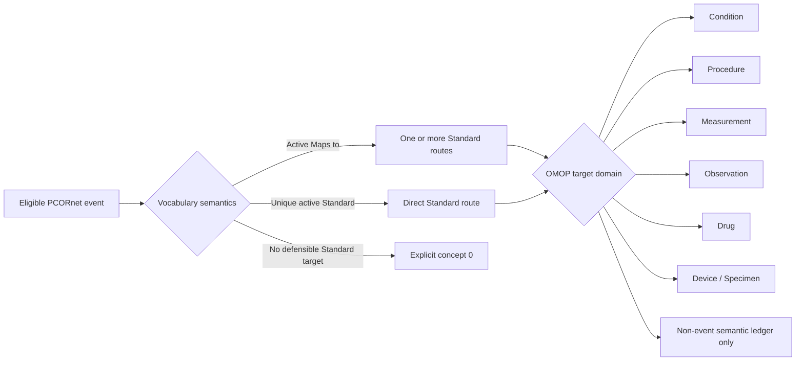

# Stage A structural and semantic concordance results

_Last updated: 2026-08-27_

## Purpose

Stage A describes how the frozen audited PCORnet-to-OMOP ETL represents source records before any patient-level phenotype or downstream analytic comparison is performed.

The frozen ETL reference is:

`887e6f4d60a6b185e58b3c9fe8887472b49777e3`

Stage A is descriptive. Row counts are outcomes of the source data, vocabulary, and frozen ETL semantics; they are not acceptance thresholds and are not tuned to reproduce the historical comparator OMOP database.

## Stage A analysis components completed

The publication-analysis code now generates:

- final OMOP target inventory;
- source eligibility and exact exclusion reasons;
- source-to-route and route-to-target reconciliation;
- concept-0 summaries;
- visit-linkage and unit/route mapping coverage;
- Procedure routing dispositions and target-domain distribution;
- canonical DIAGNOSIS/CONDITION routing summaries;
- OBS_CLIN target-domain routing;
- cross-domain routing summaries;
- mapping-mechanism summaries;
- manuscript-oriented aggregate Markdown and CSV tables.

The main Stage A generators are:

- `stage_a_structural_concordance_v2.py`;
- `stage_a_manuscript_tables.py`;
- `stage_a_exclusion_decomposition.py`.

Generated outputs remain under `results/publication_analysis/stage_a/` and are not committed automatically because `results/` remains outside Git.

## Exact source eligibility and exclusions

| Source family | Source rows | Eligible rows | Excluded rows | Excluded % | Exclusion reason |
| --- | ---: | ---: | ---: | ---: | --- |
| PROCEDURES | 11,244,947 | 11,228,023 | 16,924 | 0.151% | missing `PX_DATE` |
| OBS_CLIN | 38,850,928 | 38,850,928 | 0 | 0% | none |
| DIAGNOSIS | 11,484,577 | 8,024,792 | 3,459,785 | 30.125% | missing `DX_DATE` |
| CONDITION | 650,181 | 650,181 | 0 | 0% | none |
| PRESCRIBING | 23,756,583 | 23,756,583 | 0 | 0% | none |
| DISPENSING | 8,368,404 | 8,368,404 | 0 | 0% | none |
| MED_ADMIN | 13,654,315 | 13,654,315 | 0 | 0% | none |
| IMMUNIZATION | 21,132 | 21,132 | 0 | 0% | none |
| DEATH | 6,955 | 6,955 | 0 | 0% | none |

For DIAGNOSIS, the frozen audit recorded zero missing IDs, missing PATIDs, unlinked persons, or other source-eligibility failures; the full 3,459,785 exclusions were attributable to missing `DX_DATE`. For CONDITION, the frozen audit recorded zero missing ID/PATID, unlinked-person, missing-date, or invalid-interval exclusions. Death likewise had zero missing-PATID, missing-date, or unlinked-person exclusions.

## Procedure routing

There were 11,228,023 eligible native PCORnet PROCEDURES source events. The route ledger contained 11,234,863 rows, an expansion of 6,840 rows because one-to-many Standard mappings were preserved rather than collapsed.

| Disposition | Route rows | Distinct source events |
| --- | ---: | ---: |
| event route | 11,121,561 | 11,114,792 |
| unresolved | 111,660 | 111,660 |
| non-event semantic component | 1,642 | 1,642 |

The largest target domains were Procedure (3,996,294 routes), Measurement (3,491,076), Observation (1,836,939), Drug (1,711,406), and Device (196,230). Smaller cross-domain components included Condition (1,210) and Specimen (47). Non-event semantic components such as Spec Anatomic Site, Meas Value, Provider, Unit, Type Concept, and Route were retained in the route ledger rather than materialized as standalone clinical events.

The Procedure mapping mechanisms were dominated by direct Standard source concepts and active `Maps to` targets. Unresolved Procedure routing was primarily due to source concepts not found (81,374 routes) or no active Standard target in the source domain (30,286 routes).

## Canonical DIAGNOSIS and CONDITION routing

DIAGNOSIS and CONDITION contributed 8,674,973 eligible source events and 9,045,157 canonical route rows.

Important structural findings:

- 361,606 eligible source events produced more than one core event route, approximately 4.17% of eligible source events;
- 60,148 source events required an explicit Condition concept-0 fallback, approximately 0.69%;
- 1,388 non-event Standard routes were retained only as semantic components;
- one-to-many and cross-domain routing therefore make raw PCORnet-to-OMOP row-count equality an inappropriate fidelity criterion.

Most DIAGNOSIS routes used active `Maps to` semantics. CONDITION records included both direct Standard source concepts and `Maps to` routes. Cross-domain event targets included Observation, Procedure, Measurement, Drug, Device, and Specimen.

## OBS_CLIN routing

All 38,850,928 eligible OBS_CLIN records were represented in the frozen routing ledger.

| Target domain / status | Rows | Concept-0 rows |
| --- | ---: | ---: |
| Measurement / direct Standard | 37,327,978 | 0 |
| Observation / direct Standard | 1,471,098 | 0 |
| Condition / direct Standard | 39,115 | 0 |
| Observation / source concept not found | 12,737 | 12,737 |

Approximately 96.08% of OBS_CLIN records routed to Measurement, about 3.82% to Observation, and about 0.10% to Condition. Only 12,737 records, approximately 0.033%, remained unresolved and were retained transparently as Observation concept `0`.

## Drug mapping coverage

The Drug route ledger contains 48,457,880 rows and reconciles to the Drug Exposure materialization. Of these, 17,469,480 rows had `drug_concept_id = 0`, approximately 36.05%.

This is treated as a mapping-coverage result, not as a reconciliation failure. The largest unresolved mechanisms were absent source codes and unresolved RxNorm/NDC mappings in PRESCRIBING and MED_ADMIN. The ETL deliberately does not invent or arbitrarily select drug concepts to reduce this fraction.

Drug route standardization showed 46,725,342 rows with a standardized source route value, of which 18,346,905 mapped to a unique active Standard Route concept. The remaining standardized-but-unresolved route rows retained `route_concept_id = 0` under the explicit conservative routing policy.

## Final frozen OMOP counts

| OMOP table | Rows |
| --- | ---: |
| person | 27,089 |
| observation_period | 27,087 |
| visit_occurrence | 1,510,957 |
| condition_occurrence | 7,315,572 |
| procedure_occurrence | 4,182,803 |
| measurement | 85,715,435 |
| observation | 7,319,081 |
| drug_exposure | 48,458,058 |
| device_exposure | 196,660 |
| specimen | 93 |
| death | 6,955 |

## Interpretation

Stage A shows that the audited ETL is not a simple table-to-table copy. Source records can be excluded for explicit required-field reasons, routed into a different OMOP domain, expanded through valid one-to-many vocabulary mappings, retained as non-event semantic components, or represented with concept `0` when the source semantics do not justify a unique active Standard concept.

The important publication implication is that preservation should be judged through source eligibility, vocabulary route semantics, lineage, and downstream clinical agreement rather than raw row-count equality.

## Stage A completion decision

The structural Stage A work is considered complete for progression to Stage B because:

- all major routed source families reconcile to their frozen route ledgers;
- exact source exclusions are now decomposed by reason;
- cross-domain and one-to-many mappings are quantified;
- unresolved mappings and concept-0 policies are explicit;
- the analysis remains anchored to the frozen ETL SHA and does not alter ETL semantics.

Stage A tables should still undergo disclosure review before external release, and manuscript wording may continue to evolve without changing the underlying frozen analysis definitions.

## Next stage

Stage B will perform patient-level semantic concordance between PCORnet and the frozen OMOP build. Before running Stage B comparisons, matching rules must be pre-specified for each domain, including patient identifier linkage, date/time tolerance, one-to-many mappings, cross-domain mappings, and concept-0 handling.
