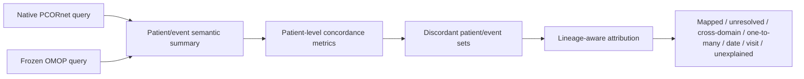
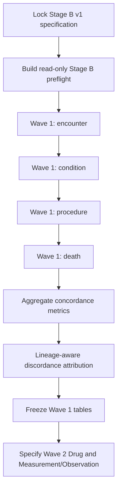

# Stage B patient-level semantic concordance specification

_Last updated: 2026-08-27_

Frozen ETL SHA: `887e6f4d60a6b185e58b3c9fe8887472b49777e3`

Machine-readable locked study definition: `study_definitions/stage_b_v1.json`.

## Objective

Stage B asks whether clinically meaningful patient-level information is represented consistently between native PCORnet data and the frozen OMOP build after the audited ETL has been fixed.

This stage is intentionally distinct from Stage A. Stage A described transformation structure, route expansion, exclusions, cross-domain materialization, and mapping coverage. Stage B moves to patient-level clinical semantics.

The primary comparison must use pre-specified CDM-native definitions. ETL lineage is used secondarily to explain discordance, not to redefine the primary outcome after results are seen.



## Fixed principles

1. The frozen ETL remains immutable. Concordance results do not justify ETL retuning by themselves.
2. The historical comparator OMOP database is not an ETL acceptance target.
3. Row-count equality is not required when one-to-many Standard mappings or cross-domain representation are semantically valid.
4. Concept `0` is reported separately as unresolved semantic coverage, not silently treated as mapped concordance.
5. Non-event semantic components retained in route ledgers are not counted as standalone clinical events.
6. Patient linkage is exact through `PATID` -> `person.person_source_value` -> `person_id`; no probabilistic linkage is introduced.
7. Matching rules, time tolerances, and concept/domain definitions must be versioned before inspecting disagreement cases.
8. Any post-result change must be recorded in the study decision log and labeled as bug correction, pre-specified sensitivity analysis, or post hoc exploratory change.

## Two-layer analysis design

### Primary layer: independent CDM-native comparison

Each domain is queried independently in PCORnet and OMOP using the locked semantic definition. Primary outputs are patient prevalence, patient overlap, event counts, temporal agreement, and concordance measures.

### Secondary layer: lineage-aware discordance attribution

Only after primary concordance is calculated do we use route ledgers/xwalks to classify discordance. This avoids making the primary comparison tautological merely because OMOP was derived from PCORnet.

## Wave 1 domains

Wave 1 intentionally starts with domains whose patient/event semantics are comparatively well defined.

### Encounters / visits

**PCORnet:** `PCORnet_ENCOUNTER`  
**OMOP:** `visit_occurrence`

Primary patient question: did the patient have an encounter/visit under the pre-specified inclusion definition?

Event-level comparison uses encounter start date versus `visit_start_date` with an exact-day tolerance (`0` days) for the first analysis. Encounter type is compared descriptively; exact category equality is not required because the frozen visit mapping intentionally preserves source encounter semantics conservatively.

The xwalk `etl_visit_occurrence_xwalk` is used only for secondary explanation of unmatched or temporally discordant events.

### Diagnoses / conditions

**PCORnet:** `PCORnet_DIAGNOSIS` + `PCORnet_CONDITION`  
**OMOP possible event domains:** Condition, Observation, Procedure, Measurement, Drug, Device, Specimen

The primary semantic unit is a patient/date/Standard-target concept-domain representation derived from a pre-specified semantic definition. Raw source-row equality to `condition_occurrence` is explicitly not the target because the frozen canonical route model permits:

- one-to-many Standard `Maps to` targets;
- cross-domain mappings;
- direct Standard source concepts;
- concept-0 fallback when no defensible event-domain mapping exists.

A one-to-many source mapping is not automatically discordant. A concept-0 fallback is considered represented structurally but unresolved semantically and is reported separately.

The canonical Condition route ledger is used for secondary attribution and for validating the semantic mapping reference, not for changing primary patient definitions after results are observed.

### Procedures

**PCORnet:** `PCORnet_PROCEDURES`  
**OMOP possible event domains:** Procedure, Condition, Device, Specimen, Drug, Measurement, Observation

The primary unit is patient/date/Standard-target concept-domain representation. Procedure source rows are not expected to equal `procedure_occurrence` rows because the frozen route ledger preserves cross-domain and one-to-many mappings.

Non-event semantic components such as units, anatomical sites, type concepts, routes, and measurement values are excluded from standalone patient-event concordance denominators. Unresolved concept-0 routes are reported separately from mapped semantic concordance.

### Death

**PCORnet:** `PCORnet_DEATH`  
**OMOP:** `death`

Primary comparison uses patient-level death presence and exact death date. Initial date tolerance is `0` days. Death type/cause concept `0` is not treated as a failure because the frozen ETL explicitly records the absence of defensible source-derived provenance semantics.

## Wave 2 domains

Drug and Measurement/Observation are deferred until their patient-level semantic units are explicitly locked.

For **Drug**, we must pre-specify how RxNorm/NDC one-to-many mappings, unresolved source drug codes, Procedure-derived drug routes, and route-of-administration coverage contribute to patient-level concordance.

For **Measurement/Observation**, we must pre-specify the LOINC/concept unit, numeric versus categorical values, UCUM normalization, date/time tolerance, and how records mapped between Measurement and Observation are treated.

## Primary metrics

For each Wave 1 domain, report at minimum:

- patients with qualifying events in PCORnet;
- patients with qualifying events in OMOP;
- intersection;
- PCORnet-only patients;
- OMOP-only patients;
- union;
- Jaccard similarity;
- positive agreement where a defensible denominator exists;
- per-patient event counts in each CDM;
- paired event-count difference;
- exact-date agreement or pre-specified tolerance agreement;
- distribution of discordance reasons.

Negative agreement should only be reported when a defensible population-at-risk denominator has been explicitly defined.

## Discordance categories

Every discordant patient/event should be assigned, when possible, to one of these mutually interpretable categories:

1. source ineligible under the pre-existing frozen rule;
2. unresolved concept `0`;
3. cross-domain representation;
4. one-to-many Standard mapping;
5. date representation difference;
6. visit linkage difference;
7. native CDM query-definition difference;
8. unexpected/unexplained difference.

Unexpected/unexplained differences are the only category that should trigger investigation for a possible implementation defect. Even then, ETL changes require independent evidence and a documented new freeze.

## Stage B outputs

Planned local outputs under `results/publication_analysis/stage_b_patient_concordance/`:

```text
manifest.json
wave1_summary.json
patient_concordance_by_domain.csv
event_count_agreement_by_domain.csv
temporal_agreement_by_domain.csv
discordance_reason_summary.csv
encounter_summary.csv
condition_summary.csv
procedure_summary.csv
death_summary.csv
stage_b_wave1_report.md
```

No row-level patient lists are committed to Git. Publication-safe aggregates may later be copied into a reviewed manuscript-output directory after disclosure review.

## Implementation order



The immediate next implementation should therefore be a read-only Stage B preflight that verifies the locked study definition, frozen ETL SHA, required source/target tables, required lineage tables, and patient-linkage integrity before any patient-level comparison is executed.
