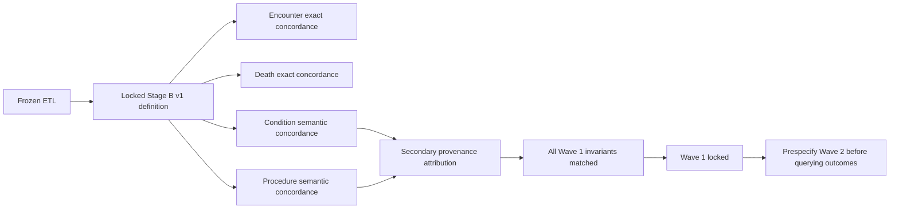

# Stage B Wave 1 lock record

Frozen ETL SHA: `887e6f4d60a6b185e58b3c9fe8887472b49777e3`

Stage B locked study definition: `study_definitions/stage_b_v1.json`

Wave 1 final aggregate outputs were produced on 2026-08-28 from the frozen ETL build and completed with all manuscript-table invariants matched.

## Final Wave 1 findings

| Domain | Source events / mapped semantic routes | Exact matched events | Source unmatched | Target rows in same semantic space | Other audited provenance | Unresolved | Non-event semantic rows | Patient Jaccard before attribution |
| --- | ---: | ---: | ---: | ---: | ---: | ---: | ---: | ---: |
| Encounter | 1,510,957 | 1,510,957 | 0 | 1,510,957 | 0 | 0 | 0 | 1.0000000000 |
| Death | 6,955 | 6,955 | 0 | 6,955 | 0 | 0 | 0 | 1.0000000000 |
| Condition semantics | 8,983,621 | 8,983,621 | 0 | 9,739,734 | 756,113 | 60,148 | 0 | 0.9706684857 |
| Procedure semantics | 11,121,561 | 11,121,561 | 0 | 12,659,204 | 1,537,643 | 111,660 | 1,642 | 0.9954568959 |

Source event match percent was 100% for all four Wave 1 comparisons.

## Invariant closure

The final Wave 1 summary reported all checks as true:

- Encounter source and target event counts matched, with no unmatched dates.
- Death source and target event counts matched, with no death-date discordance.
- Every mapped nonzero Condition semantic route was found exactly in native OMOP.
- Condition target-side excess in the same Standard concept/domain space was completely explained by other audited provenance.
- Every mapped nonzero Procedure semantic route was found exactly in native OMOP.
- Procedure target-side excess in the same Standard concept/domain space was completely explained by other audited provenance.

## Procedure provenance attribution

Procedure target-side excess totaled 1,537,643 rows and was fully attributable to other audited source provenance rather than missing or duplicated mapped Procedure semantics.

| Target domain | Procedure-derived rows | Other provenance rows |
| --- | ---: | ---: |
| Condition | 1,208 | 469,596 |
| Device | 196,224 | 292 |
| Drug | 1,682,188 | 516,168 |
| Measurement | 3,491,072 | 136,881 |
| Observation | 1,836,895 | 381,904 |
| Procedure | 3,913,928 | 32,773 |
| Specimen | 46 | 29 |

## Interpretation

Wave 1 demonstrates that, after locking ETL rules independently of downstream agreement, mapped source semantics were preserved exactly for Encounter, Death, Condition, and Procedure under the prespecified comparison rules. Lower patient Jaccard values for the semantic Condition and Procedure comparisons were caused by additional native OMOP rows occupying the same Standard concept/domain spaces. Lineage-aware secondary attribution showed that these rows came from other audited source families, so concept-space excess is not synonymous with ETL error.

Concept-0 unresolved routes remain explicit coverage limitations rather than failed mapped concordance. Procedure non-event semantic components remain ledger-level semantic components and are not standalone event concordance failures.

## Freeze policy for downstream stages

Wave 1 is now locked as a completed Stage B analysis wave. No ETL mapping or Wave 1 matching rule should be changed in response to these results unless an independently demonstrated methodological defect is documented first. Later study code may add new prespecified analyses, but it must not retroactively redefine these Wave 1 outcomes.

