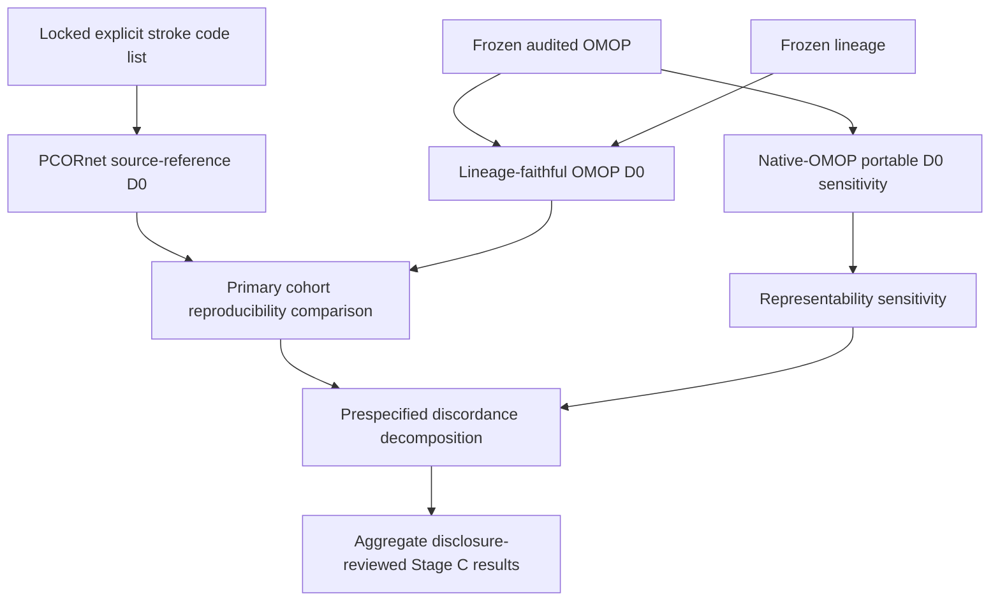

# Stage C stroke D0 phenotype reproducibility specification

Frozen ETL SHA: `887e6f4d60a6b185e58b3c9fe8887472b49777e3`

Locked definition: `study_definitions/stage_c_stroke_d0_v1.json`

Status: **outcome analysis complete; manuscript/invariant lock pending**

## Objective

Stage C asks a different question from Stage B. Stage B established that mapped source semantics are present in the frozen OMOP build under prespecified event-level rules. Stage C now asks whether a complete computable phenotype selects the same patients after transformation.

The first phenotype is the PSU PROMIS EHR-only ischemic-stroke D0 definition already represented in `stroke_codes.py` and `pcornet_stroke_phenotypes.py`. This specification froze the D0 rules before the publication D0 comparison.

## Source-reference D0

The primary PCORnet reference phenotype is:

- exact explicit ischemic-stroke ICD code membership after uppercasing, trimming, and removing decimal points;
- `PDX == 'P'`;
- encounter type `EI` or `IP`;
- at least one overnight stay, defined as a calendar-day difference of at least one day between admission and discharge dates;
- for each encounter, choose the first qualifying primary stroke diagnosis ordered by `DX_DATE` with nulls last and then normalized DX;
- define the encounter index date as `COALESCE(DX_DATE, ADMIT_DATE, DISCHARGE_DATE)`;
- choose the first qualifying encounter per patient ordered by index date and encounter identifier;
- only after index selection, require `floor(days(BIRTH_DATE, INDEX_DATE) / 365.0) >= 18`;
- no registry gating or registry augmentation.

A recognized-`DX_TYPE` restriction is not part of the primary D0 phenotype. It may be reported only as a diagnostic sensitivity.

## Why Stage C has two OMOP estimands

A critical representation issue was fixed before outcome comparison: the source phenotype requires `PDX`, but the frozen OMOP core representation does not encode the PCORnet `PDX` field as a native OMOP phenotype attribute. Treating this as though it had a native one-to-one OMOP equivalent would silently change the phenotype.

Therefore Stage C D0 has two distinct estimands.

### Primary: transformation-fidelity D0

The primary analysis tests whether the **exact source-defined phenotype semantics** survive the transformation. Native OMOP person, visit, condition, and date fields are used for transformed events, while frozen lineage may be used only for source-only semantics that cannot be expressed natively, especially `PDX == 'P'` and exact source diagnosis-code identity.

This is the appropriate estimand for asking whether the frozen transformation preserves the original D0 cohort.

### Secondary: native-OMOP portable D0

A separate sensitivity analysis expresses a D0-like phenotype using OMOP-native semantics only:

- the explicit locked ICD code list is resolved through the frozen vocabulary to active Standard Condition concepts using exact source concepts and `Maps to` relationships, preserving one-to-many mappings;
- EI and IP use the frozen Standard Visit mappings `262` and `9201`;
- overnight stay and adult age use OMOP dates/person data;
- `PDX == 'P'` is intentionally omitted because it is not natively representable in the frozen OMOP core.

This portable phenotype is not allowed to replace the primary transformation-fidelity comparison. Its difference from the source cohort is itself a model-representability result.

## Completed preflight

The read-only preflight completed successfully before D0 outcome comparison.

- all 27,089 distinct source PATIDs linked uniquely to `person.person_source_value`;
- no duplicate source PATID groups and no duplicate target `person_source_value` groups;
- all 118 locked ICD-10-CM and all 9 locked ICD-9-CM codes resolved to active source concepts and at least one Standard Condition target;
- the frozen EI/IP Standard Visit concepts were valid active Standard concepts (`262` and `9201`);
- no native OMOP core column representing PCORnet `PDX` was present;
- required source and target columns were present;
- no D0 cohort outcome query was performed by the preflight.

## D0 concordance result

The locked D0 outcome analysis was run without changing the frozen ETL or the prespecified phenotype.

Primary transformation-fidelity result:

- PCORnet source D0 patients: **9,815**;
- lineage-faithful OMOP D0 patients: **6,001**;
- shared patients: **6,001**;
- source-only patients: **3,814**;
- OMOP-only patients: **0**;
- patient Jaccard: **0.6114111055**;
- positive agreement: **75.8852%**;
- exact index-date agreement among shared patients: **100% (6,001 / 6,001)**;
- within-one-day agreement among shared patients: **100%**.

All **3,814** primary source-only patients were assigned to the prespecified `required_source_date_missing_or_etl_excluded` category. The source D0 definition permits the encounter index date to fall back to `ADMIT_DATE` or `DISCHARGE_DATE` when `DX_DATE` is null, whereas the frozen ETL excludes diagnoses that lack the required diagnosis date. Thus the observed primary attrition is a direct consequence of a locked source-phenotype fallback interacting with the frozen ETL required-date policy, not an unexplained loss of a transformed eligible diagnosis.

The secondary native-OMOP portability sensitivity produced:

- native OMOP patients: **7,667**;
- shared with source D0: **6,312**;
- source-only: **3,503**;
- native-OMOP-only: **1,355**;
- Jaccard: **0.5650850492**;
- positive agreement: **72.2114%**.

Because this sensitivity intentionally omits `PDX == 'P'`, it is a model-portability result and does not replace the primary transformation-fidelity estimand.

## Metrics

The primary comparison reports PCORnet and lineage-faithful OMOP cohort sizes, shared patients, source-only and OMOP-only patients, Jaccard similarity, positive agreement, and exact index-date agreement. Index dates within one day are secondary. The native-portable OMOP cohort is reported separately.

Discordance is decomposed into predefined categories such as required source-date exclusion, missing visit or condition materialization/lineage, source-only primary-diagnosis semantics, index-date representation, age boundary, multiple-event ordering, and unexplained differences.

No patient-level identifiers or disagreement rows are committed. Only aggregate, disclosure-reviewed summaries may enter Git.

## D1 and D3 are deliberately deferred

D1 and D3 require the exact lipid LOINC whitelist used by the PROMIS pipeline. The existing verification code discovers that list from an external CSV. For publication reproducibility, the whitelist must first be versioned or otherwise hashed as a study artifact before D1/D3 are locked and queried. Their imaging and lipid windows will likewise be fixed before outcome comparison.

## Freeze rule

No ETL mapping, stroke code, D0 rule, matching rule, or discordance category may be changed merely because a later comparison improves or worsens agreement. Any correction after outcome inspection requires an independently demonstrated methodological defect and an explicit decision-log entry.
