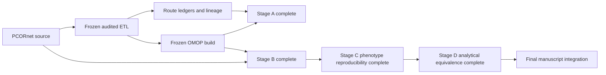
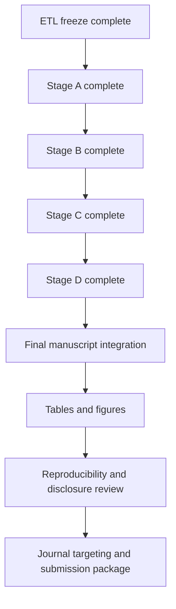

# Current status and publication plan

_Last updated: 2026-09-01_

For the full historical record and methodological decisions, see `docs/project_history_and_decisions.md`. Completed stage records include `docs/stage_a_structural_semantic_results.md`, the Stage B lock/manuscript files, `docs/stage_c_stroke_completion_record.md`, and `docs/stage_d_stroke_completion_record.md`. The integrated manuscript draft through Stage D is `docs/publication_integrated_manuscript_draft_through_stage_d.md`.

## Current status

The audited PCORnet-to-OMOP ETL is frozen for publication at:

`887e6f4d60a6b185e58b3c9fe8887472b49777e3`

Publication analysis proceeds on `publication/analysis`. The frozen ETL remains immutable unless a new independently demonstrated ETL defect requires a documented new freeze.

Stage A is complete. Stage B is complete and locked. Stage C D0/D1/D3 are complete and closed. Stage D analytical equivalence is complete and closed.

## Frozen OMOP target counts

| OMOP table | Rows |
| --- | ---: |
| person | 27,089 |
| observation_period | 27,087 |
| visit_occurrence | 1,510,957 |
| condition_occurrence | 7,315,572 |
| procedure_occurrence | 4,182,803 |
| measurement | 85,715,435 |
| observation | 7,319,081 |
| drug_exposure | 48,458,058 |
| device_exposure | 196,660 |
| specimen | 93 |
| death | 6,955 |

These counts are recorded outcomes, not acceptance thresholds.

## Stage A status: complete

Stage A structural and semantic reconciliation is complete. Major explicit exclusions were 3,459,785 DIAGNOSIS rows missing `DX_DATE` and 16,924 PROCEDURES rows missing `PX_DATE`. One-to-many Standard mappings, cross-domain routing, and concept-zero coverage were retained and reported rather than forced into one-to-one row equality.

## Stage B status: complete and locked

Mapped Encounter, Death, Condition, Procedure, Drug, and Measurement/Observation semantics were preserved exactly in the prespecified mapped denominators. Target-side excess for Condition and Procedure was fully explained by audited alternate source provenance. Resolved UCUM and mapped categorical values agreed exactly. All initially observed VITAL numeric differences were explained by the frozen SQL expression, leaving zero unexplained target mismatches.

## Stage C status: complete and closed

The source D0 cohort contained 9,815 patients and the lineage-faithful OMOP cohort contained 6,001, with 6,001 shared exact-index patients. D1 patient Jaccard was 0.608 and D3 patient Jaccard was 0.622. Post-outcome mechanism audits showed that all D1/D3 source-only patients had null selected `DX_DATE` and lacked diagnosis lineage under the frozen required-date ETL policy. All residual shared-patient index-date differences were explained by selection of another qualifying episode after loss of the source-selected diagnosis.

The dominant Stage C discordance therefore arose upstream at diagnosis materialization, not from progressive CT/MRI or lipid transformation failure.

## Stage D status: complete and closed

Stage D was prespecified in `study_definitions/stage_d_stroke_analytical_equivalence_v1.json` before cross-CDM outcome queries. The outcome-free preflight used analysis SHA `6e6d2139ab09648b5c59770788ce7762ed5ffb7d`. The completed Stage D analysis used SHA `1e4508ff55928965249beb843646232f3a234048`; the intervening change only corrected a SQL Server aggregation syntax expression and did not alter any locked scientific definition.

### Fixed-index 90-day acute-care outcome

Among 3,822 patients observable in both representations, PCORnet and OMOP each identified 1,132 events. Risk was 29.6180% in both. Absolute risk difference was 0.0000 percentage points and the OMOP/source risk ratio was 1.0000. Both prespecified equivalence margins were met. All 1,132 both-positive patients had exactly concordant first-event dates.

### Fixed-index 30-day acute-care outcome

Among 4,374 patients, both representations identified 753 events. Risk was 17.2154% in both. Absolute risk difference was 0.0000 percentage points and risk ratio was 1.0000. Both equivalence margins were met.

### End-to-end reproducibility

End-to-end equivalence failed because the independently selected source and OMOP D0 cohorts differed upstream. At 90 days, source risk was 27.6275% and OMOP risk was 29.6180%, with absolute difference +1.9905 percentage points and risk ratio 1.0720. At 30 days, source risk was 16.1880% and OMOP risk was 17.2154%, with absolute difference +1.0274 percentage points and risk ratio 1.0635. Neither endpoint met the prespecified absolute or relative equivalence margins.

This contrast localizes the analytical divergence to cohort construction rather than post-index acute-care outcome representation.

### Exploratory recurrent ischemic stroke

Among 2,531 fixed-index patients with 365-day observability, PCORnet identified 263 recurrent events and OMOP identified 258. Label agreement was 2,526/2,531 (99.80%), with five source-only positives and no OMOP-only positives.

The aggregate-only diagnostic at SHA `6321336996cd826dfade84509a81691a8aaaf260` showed that all five discordant patients retained visit lineage, an acute-care OMOP visit, and correct temporal placement, but lacked a DIAGNOSIS-to-condition crosswalk for the qualifying recurrent diagnosis and therefore lacked a linked OMOP condition. None was a day-31/day-365 boundary case. The discordance is diagnosis materialization/condition-lineage loss, not encounter or timing drift.

## Methodological decisions that remain fixed

- Do not use the comparator OMOP database as an ETL acceptance target.
- Do not require raw row-count equality where one-to-many or cross-domain semantics apply.
- Preserve one-to-many Standard mappings and cross-domain routes.
- Do not choose arbitrary vocabulary candidates.
- Use concept `0` when source semantics do not justify a unique Standard concept.
- Retain non-event semantic targets in route ledgers rather than creating false standalone events.
- Exclude missing required dates explicitly rather than invent sentinel dates.
- Do not retune the frozen ETL from downstream concordance findings alone.
- Keep native-model portability separate from lineage-faithful transformation fidelity.
- Keep unresolved vocabulary/unit/value mappings separate from mapped semantic agreement.
- Treat post-outcome mechanism audits as explanatory, not prespecified confirmatory analyses.
- Distinguish fixed-index outcome fidelity from end-to-end analytical reproducibility.

## Publication roadmap

## Immediate next steps

1. Treat Stages A-D as analytically closed for routine work.
2. Use `docs/publication_integrated_manuscript_draft_through_stage_d.md` as the current manuscript synthesis.
3. Build the final main tables and figures from the locked aggregate outputs rather than rerunning exploratory analyses.
4. Perform a final consistency audit across manuscript numbers, study-definition hashes, analysis SHAs, and disclosure statements.
5. Decide journal target and adapt word count, table count, supplement structure, and reporting format to that journal.
6. Keep all patient-level disagreement rows outside Git; only aggregate disclosure-reviewed summaries may be committed.

## Manuscript framing

The paper should preserve four distinct layers: structural transformation, mapped semantic preservation, complete phenotype reproducibility, and downstream analytical equivalence. The strongest Stage D result is conditional: post-index acute-care outcome representation is exactly preserved when patient and index date are held fixed, while end-to-end equivalence fails because upstream phenotype attrition changes the population entering the analysis.

The paper should not claim that OMOP and PCORnet are globally equivalent or globally nonequivalent. The evidence instead shows where equivalence holds, where it fails, and the mechanism responsible.

## Reproducibility rule

Every publication analysis run should record the frozen ETL SHA, analysis-code SHA, configuration hash without secrets, study-definition version/hash, input audit/freeze-manifest hashes where applicable, run timestamp, and aggregate output hashes/counts sufficient to regenerate tables and figures. Row-level data remain outside Git; aggregate outputs require disclosure review before external sharing.
