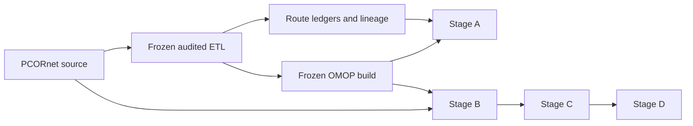
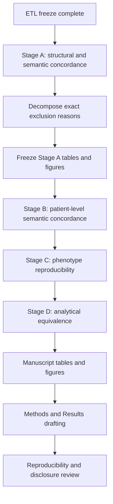

# Current status and publication plan

_Last updated: 2026-08-27_

For the full historical record, methodological decisions, detailed Stage A findings, and Mermaid roadmap, see `docs/project_history_and_decisions.md`.

## Current status

The audited PCORnet-to-OMOP ETL is frozen for publication at:

`887e6f4d60a6b185e58b3c9fe8887472b49777e3`

The final rebuild was executed from an empty isolated validated target, with the comparator/prior OMOP database left untouched. The freeze passed matched global reconciliation, matched visit-time semantics, zero duplicate primary-key groups, zero reversed audited intervals, zero hard semantic blockers, zero unexplained review flags, zero auxiliary concept blockers, and a clean Phase 14 worktree.

Publication analysis proceeds on `publication/analysis`. The frozen ETL is treated as immutable unless a new independently demonstrated ETL defect requires a documented new freeze.

## Frozen OMOP target counts

| OMOP table | Rows |
| --- | ---: |
| person | 27,089 |
| observation_period | 27,087 |
| visit_occurrence | 1,510,957 |
| condition_occurrence | 7,315,572 |
| procedure_occurrence | 4,182,803 |
| measurement | 85,715,435 |
| observation | 7,319,081 |
| drug_exposure | 48,458,058 |
| device_exposure | 196,660 |
| specimen | 93 |
| death | 6,955 |

These counts are recorded outcomes, not acceptance thresholds.

## Stage A status

Stage A structural and semantic concordance is in progress and the core aggregate/manuscript-oriented summaries have been generated from the frozen audit bundle and route ledgers.

Current Stage A outputs include source eligibility/exclusions, route-to-target reconciliation, concept-0 summaries, visit/unit/route coverage, cross-domain routing, Procedure dispositions and target-domain summaries, Condition canonical routing, OBS_CLIN routing, mapping-mechanism summaries, and manuscript-oriented Markdown tables.

Key findings so far:

- PROCEDURES: 11,228,023 eligible source events produced 11,234,863 routes because one-to-many mappings were preserved; 111,660 routes were unresolved and 1,642 were non-event semantic components.
- OBS_CLIN: 37,327,978 of 38,850,928 eligible records routed to Measurement (~96.08%); 12,737 records (~0.033%) remained unresolved and were retained as Observation concept `0`.
- DIAGNOSIS + CONDITION: 8,674,973 eligible source events produced 9,045,157 canonical routes; 361,606 source events (~4.17%) had multiple core event routes and 60,148 (~0.69%) required Condition concept-0 fallback.
- Drug: 17,469,480 routed Drug Exposure rows (~36.05%) had drug concept `0`; this is an explicit mapping-coverage result rather than a reconciliation failure.

The main remaining Stage A cleanup is to decompose source exclusions by exact rule, especially DIAGNOSIS and PROCEDURES, before the eligibility/exclusion table is considered manuscript-ready.

## Methodological decisions that remain fixed

- Do not use the comparator OMOP database as an ETL acceptance target.
- Do not require row-count equality between PCORnet and OMOP.
- Preserve one-to-many Standard mappings and cross-domain routes.
- Do not choose arbitrary vocabulary candidates.
- Use concept `0` when source semantics do not justify a unique Standard concept.
- Retain non-event semantic targets in route ledgers rather than creating false standalone events.
- Exclude missing required dates explicitly rather than inventing sentinel dates.
- Do not retune ETL mappings from downstream concordance findings alone.

## Publication roadmap

### Stage A — structural and semantic concordance

Finish exclusion-reason decomposition, perform disclosure review, freeze publication-safe aggregate tables/figure inputs, and draft the ETL/Stage A Results section from scripted outputs.

### Stage B — patient-level semantic concordance

Pre-specify patient/event matching rules, time tolerances, handling of one-to-many/cross-domain routes and concept `0`, then compare diagnoses, procedures, medications, measurements, encounters, observations, and death using patient overlap and agreement metrics.

### Stage C — phenotype reproducibility

Lock phenotype specifications before viewing disagreement cases, implement them independently in PCORnet and frozen OMOP, and compare cohort size, overlap, Jaccard similarity, positive agreement, and classified discordance reasons. Existing stroke-oriented modules are the expected starting point.

### Stage D — analytical equivalence

Run matched pre-specified downstream analyses in both CDMs and compare estimates, uncertainty, and conclusions. Differences should be traced back to documented ETL/CDM representation effects where possible.

## Manuscript framing

The paper should separate two questions:

1. **Did the audited ETL behave as specified?** The frozen rebuild answers this with matched reconciliation and zero hard/unexplained blockers.
2. **How much do clinically meaningful and analytic results differ between PCORnet and OMOP after using a validated ETL?** Stages A-D answer this without further ETL tuning.

This separation is central to the study because it prevents defects in a historical converter from being mistaken for intrinsic differences between the PCORnet and OMOP data models.

## Reproducibility rule

Every publication analysis run should record the frozen ETL SHA, analysis-code SHA, configuration hash without secrets, study-definition version, input audit/freeze-manifest hashes, run timestamp, and output hashes/counts sufficient to regenerate tables and figures. Row-level data remain outside Git; aggregate outputs require disclosure review before external sharing.
