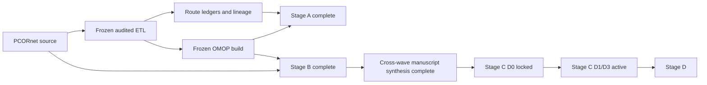
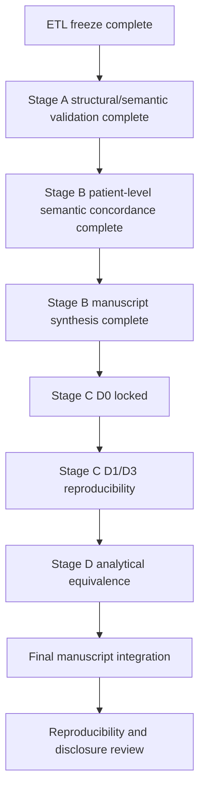

# Current status and publication plan

_Last updated: 2026-08-29_

For the full historical record and methodological decisions, see `docs/project_history_and_decisions.md`. For completed Stage A findings, see `docs/stage_a_structural_semantic_results.md`. For locked Stage B results, see `docs/stage_b_wave1_lock_record.md`, `docs/stage_b_wave2_lock_record.md`, and `docs/publication_stage_b_manuscript_draft.md`. For Stage C D0, see `docs/stage_c_stroke_d0_lock_record.md`.

## Current status

The audited PCORnet-to-OMOP ETL is frozen for publication at:

`887e6f4d60a6b185e58b3c9fe8887472b49777e3`

The final rebuild was executed from an empty isolated validated target, with the comparator/prior OMOP database left untouched. Publication analysis proceeds on `publication/analysis`. The frozen ETL is immutable unless a new independently demonstrated ETL defect requires a documented new freeze.

Stage A is complete. Stage B is analytically complete and locked. Stage C D0 is complete and locked. Stage C D1/D3 are prespecified and active.

## Frozen OMOP target counts

| OMOP table | Rows |
| --- | ---: |
| person | 27,089 |
| observation_period | 27,087 |
| visit_occurrence | 1,510,957 |
| condition_occurrence | 7,315,572 |
| procedure_occurrence | 4,182,803 |
| measurement | 85,715,435 |
| observation | 7,319,081 |
| drug_exposure | 48,458,058 |
| device_exposure | 196,660 |
| specimen | 93 |
| death | 6,955 |

These counts are recorded outcomes, not acceptance thresholds.

## Stage A status — complete

Stage A structural and semantic concordance is complete. The final package includes source eligibility and exact exclusion reasons, source-to-route and route-to-target reconciliation, concept-0 summaries, visit/unit/route coverage, cross-domain routing, Procedure dispositions and target-domain summaries, Condition canonical routing, OBS_CLIN routing, mapping-mechanism summaries, and manuscript-oriented outputs.

Key findings include 16,924 PROCEDURES exclusions due to missing `PX_DATE`, 3,459,785 DIAGNOSIS exclusions due to missing `DX_DATE`, explicit one-to-many route expansion, 60,148 Condition concept-zero fallbacks, 12,737 unresolved OBS_CLIN Observation routes, and 17,469,480 Drug concept-zero routes. These are documented outputs and coverage findings, not comparator-based acceptance targets.

## Stage B status — analytically complete and locked

Both Stage B waves are complete downstream of the frozen ETL. Encounter and Death were exactly concordant. All mapped Condition and Procedure semantic routes were found exactly in native OMOP with target-side excess fully explained by audited alternate provenance. Drug and Measurement/Observation mapped semantic events likewise reconciled exactly. Resolved UCUM and mapped categorical value concepts agreed exactly. The VITAL direct-source numeric differences were fully explained by the frozen SQL expression, leaving zero unexplained target mismatches.

The cross-wave Stage B synthesis is implemented in `stage_b_cross_wave_manuscript_bundle.py`, with manuscript-oriented Methods/Results text in `docs/publication_stage_b_manuscript_draft.md`.

## Stage C status

### D0 — complete and locked

The locked source-reference D0 cohort contained 9,815 patients; the lineage-faithful OMOP cohort contained 6,001. All 6,001 shared patients had exactly matching index dates. All 3,814 source-only patients were explained by the prespecified required diagnosis-date missingness / ETL exclusion interaction, with zero OMOP-only patients. The native-OMOP portability sensitivity was reported separately because PDX has no native OMOP core equivalent.

### D1/D3 — prespecified and active

D1/D3 are locked under `study_definitions/stage_c_stroke_d1_d3_v1.json` before any outcome query. The exact PROMIS lipid LOINC whitelist is versioned at `study_definitions/artifacts/stage_c_lipid_loinc_whitelist_v1.csv` with provenance recorded separately.

The corrected outcome-free preflight established 214 locked source-reference lipid LOINCs, 194 active source concepts, and 192 active Standard Measurement/Observation targets (187 Measurement and 5 Observation), leaving 22 frozen-vocabulary coverage gaps for the secondary native-portability analysis. All 9 locked imaging CPT codes resolve to active Standard Procedure concepts. `SPECIMEN_DATE` is the selected source lipid date under the prespecified field priority; `RESULT_DATE` is also available but lower priority.

Before the first D1/D3 outcome query, the definition was clarified to distinguish source evidence dates from the dates actually materialized by the frozen ETL. Source-reference lipid windows use the prespecified source date (`SPECIMEN_DATE` in this build), while transformation-fidelity OMOP windows use native frozen target dates (`measurement_date`/`observation_date`). A lineage-linked event crossing a window solely because those representations differ is reported explicitly as an evidence-date representation difference rather than silently harmonized. This clarification changed the study-definition hash, so the preflight must be rerun once against the final locked definition before concordance executes.

The concordance module `stage_c_stroke_d1_d3_concordance.py` is implemented and guarded so it refuses to run if the latest preflight study-definition hash does not match the current locked definition.

## Methodological decisions that remain fixed

- Do not use the comparator OMOP database as an ETL acceptance target.
- Do not require raw row-count equality between PCORnet and OMOP where one-to-many or cross-domain semantics apply.
- Preserve one-to-many Standard mappings and cross-domain routes.
- Do not choose arbitrary vocabulary candidates.
- Use concept `0` when source semantics do not justify a unique Standard concept.
- Retain non-event semantic targets in route ledgers rather than creating false standalone events.
- Exclude missing required dates explicitly rather than inventing sentinel dates.
- Do not retune ETL mappings from downstream concordance findings alone.
- Use target lineage only for secondary attribution or source-only phenotype semantics that are not natively represented.
- Keep unresolved vocabulary/unit/value mappings separate from mapped semantic agreement.
- Treat analysis counts as outputs and coverage findings, not hard-coded acceptance thresholds.

## Publication roadmap

## Immediate next steps

1. Rerun the D1/D3 outcome-free preflight against the final locked study-definition hash.
2. If it passes, run `stage_c_stroke_d1_d3_concordance` without changing the locked definition.
3. Review aggregate transformation-fidelity, evidence-date representation, vocabulary-coverage, and native-portability results before manuscript bundling.
4. Keep all patient-level disagreement rows outside Git; only aggregate disclosure-reviewed summaries may be committed.
5. Do not modify the frozen ETL based on Stage C disagreement unless an independent ETL defect is demonstrated and documented.

## Manuscript framing

The paper should preserve a clear separation among four questions: ETL correctness, mapped event-level semantic preservation, complete phenotype reproducibility, and downstream analytical equivalence. Stage C tests complete computable phenotypes without conflating source-date policy, model representability, vocabulary coverage, or source-only lineage semantics with ETL defects.

## Reproducibility rule

Every publication analysis run should record the frozen ETL SHA, analysis-code SHA, configuration hash without secrets, study-definition version/hash, input audit/freeze-manifest hashes where applicable, run timestamp, and output hashes/counts sufficient to regenerate tables and figures. Row-level data remain outside Git; aggregate outputs require disclosure review before external sharing.
