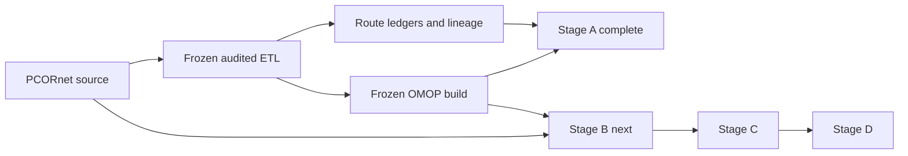
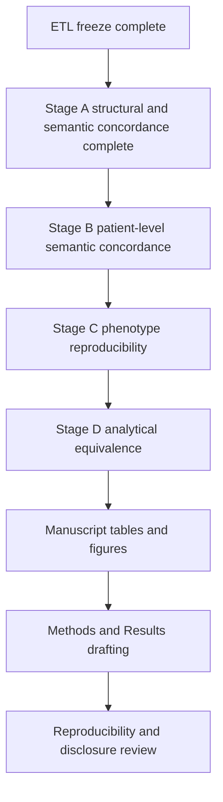

# Current status and publication plan

_Last updated: 2026-08-27_

For the full historical record and methodological decisions, see `docs/project_history_and_decisions.md`. For the completed Stage A findings, see `docs/stage_a_structural_semantic_results.md`.

## Current status

The audited PCORnet-to-OMOP ETL is frozen for publication at:

`887e6f4d60a6b185e58b3c9fe8887472b49777e3`

The final rebuild was executed from an empty isolated validated target, with the comparator/prior OMOP database left untouched. The freeze passed matched global reconciliation, matched visit-time semantics, zero duplicate primary-key groups, zero reversed audited intervals, zero hard semantic blockers, zero unexplained review flags, zero auxiliary concept blockers, and a clean Phase 14 worktree.

Publication analysis proceeds on `publication/analysis`. The frozen ETL is treated as immutable unless a new independently demonstrated ETL defect requires a documented new freeze.

## Frozen OMOP target counts

| OMOP table | Rows |
| --- | ---: |
| person | 27,089 |
| observation_period | 27,087 |
| visit_occurrence | 1,510,957 |
| condition_occurrence | 7,315,572 |
| procedure_occurrence | 4,182,803 |
| measurement | 85,715,435 |
| observation | 7,319,081 |
| drug_exposure | 48,458,058 |
| device_exposure | 196,660 |
| specimen | 93 |
| death | 6,955 |

These counts are recorded outcomes, not acceptance thresholds.

## Stage A status — structurally complete

Stage A structural and semantic concordance is complete for progression to Stage B. The final Stage A package includes source eligibility and exact exclusion reasons, source-to-route and route-to-target reconciliation, concept-0 summaries, visit/unit/route coverage, cross-domain routing, Procedure dispositions and target-domain summaries, Condition canonical routing, OBS_CLIN routing, mapping-mechanism summaries, and manuscript-oriented Markdown/CSV outputs.

Key findings:

- PROCEDURES: 11,244,947 source rows; 11,228,023 eligible; 16,924 excluded, all for missing `PX_DATE`. Eligible events produced 11,234,863 route rows because one-to-many mappings were preserved.
- OBS_CLIN: 38,850,928 source and eligible rows; 37,327,978 (~96.08%) routed to Measurement; only 12,737 (~0.033%) remained unresolved as Observation concept `0`.
- DIAGNOSIS: 11,484,577 source rows; 8,024,792 eligible; 3,459,785 excluded, all due to missing `DX_DATE`.
- CONDITION: 650,181 source and eligible rows with no recorded eligibility exclusions.
- DIAGNOSIS + CONDITION together produced 9,045,157 canonical routes from 8,674,973 eligible events; 361,606 source events (~4.17%) had multiple core event routes and 60,148 (~0.69%) required Condition concept-0 fallback.
- Drug: 17,469,480 routed Drug Exposure rows (~36.05%) had drug concept `0`; this remains an explicit source/vocabulary mapping-coverage result rather than a reconciliation failure.
- Death: 6,955 source and eligible rows with zero missing-PATID, missing-date, or unlinked-person exclusions.

Stage A is considered complete because routed source families reconcile to the frozen route ledgers, exact exclusions are decomposed by reason, one-to-many/cross-domain behavior is quantified, unresolved mappings are explicit, and analysis remains anchored to the frozen ETL SHA.

## Methodological decisions that remain fixed

- Do not use the comparator OMOP database as an ETL acceptance target.
- Do not require row-count equality between PCORnet and OMOP.
- Preserve one-to-many Standard mappings and cross-domain routes.
- Do not choose arbitrary vocabulary candidates.
- Use concept `0` when source semantics do not justify a unique Standard concept.
- Retain non-event semantic targets in route ledgers rather than creating false standalone events.
- Exclude missing required dates explicitly rather than inventing sentinel dates.
- Do not retune ETL mappings from downstream concordance findings alone.

## Publication roadmap

### Stage B — patient-level semantic concordance

Before running comparisons, pre-specify domain-level matching rules: patient linkage, event identity, date/time tolerances, one-to-many handling, cross-domain handling, and concept-0 treatment. Then compare encounters, diagnoses/conditions, procedures, medications, measurements, observations, and death using overlap and agreement metrics.

Recommended primary metrics include patient prevalence in each CDM, intersection/union counts, Jaccard similarity, positive agreement, event-count differences where meaningful, temporal agreement for matched events, and discordance decomposition by ETL route reason.

### Stage C — phenotype reproducibility

Lock phenotype specifications before viewing disagreement cases, implement them independently in PCORnet and frozen OMOP, and compare cohort size, overlap, Jaccard similarity, positive agreement, and classified discordance reasons. Existing stroke-oriented modules remain the intended starting point.

### Stage D — analytical equivalence

Run matched pre-specified downstream analyses in both CDMs and compare estimates, uncertainty, and conclusions. Differences should be traced back to documented ETL/CDM representation effects where possible.

## Immediate next steps

1. Define and document the Stage B matching specification before querying patient-level concordance.
2. Implement a read-only Stage B manifest and domain-level concordance framework.
3. Start with a small set of high-value domains where semantics are well defined: encounters, diagnoses/conditions, procedures, and death.
4. Add medications and measurement/observation families after the matching rules for one-to-many and cross-domain events are validated.
5. Lock the first phenotype specification before inspecting phenotype disagreement cases.
6. Keep all patient-level outputs outside Git; only aggregate disclosure-reviewed summaries should be committed.

## Manuscript framing

The paper should separate two questions:

1. **Did the audited ETL behave as specified?** The frozen rebuild and completed Stage A answer this with matched reconciliation, zero hard/unexplained blockers, explicit exclusions, and quantified routing/mapping behavior.
2. **How much do clinically meaningful and analytic results differ between PCORnet and OMOP after using a validated ETL?** Stages B-D answer this without further ETL tuning.

This separation is central to the study because it prevents defects in a historical converter from being mistaken for intrinsic differences between the PCORnet and OMOP data models.

## Reproducibility rule

Every publication analysis run should record the frozen ETL SHA, analysis-code SHA, configuration hash without secrets, study-definition version, input audit/freeze-manifest hashes, run timestamp, and output hashes/counts sufficient to regenerate tables and figures. Row-level data remain outside Git; aggregate outputs require disclosure review before external sharing.
