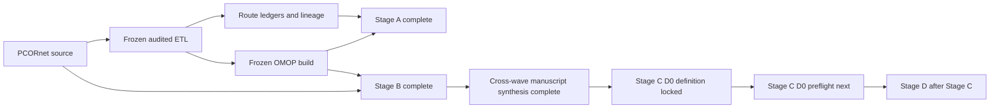
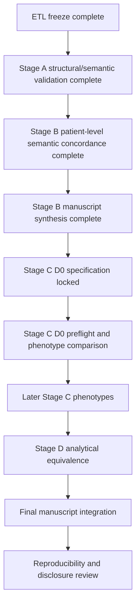

# Current status and publication plan

_Last updated: 2026-08-28_

For the full historical record and methodological decisions, see `docs/project_history_and_decisions.md`. For completed Stage A findings, see `docs/stage_a_structural_semantic_results.md`. For locked Stage B results, see `docs/stage_b_wave1_lock_record.md`, `docs/stage_b_wave2_lock_record.md`, and `docs/publication_stage_b_manuscript_draft.md`. For the first Stage C phenotype specification, see `docs/stage_c_stroke_d0_spec.md`.

## Current status

The audited PCORnet-to-OMOP ETL is frozen for publication at:

`887e6f4d60a6b185e58b3c9fe8887472b49777e3`

The final rebuild was executed from an empty isolated validated target, with the comparator/prior OMOP database left untouched. The freeze passed matched global reconciliation, matched visit-time semantics, zero duplicate primary-key groups, zero reversed audited intervals, zero hard semantic blockers, zero unexplained review flags, zero auxiliary concept blockers, and a clean Phase 14 worktree.

Publication analysis proceeds on `publication/analysis`. The frozen ETL is immutable unless a new independently demonstrated ETL defect requires a documented new freeze.

## Frozen OMOP target counts

| OMOP table | Rows |
| --- | ---: |
| person | 27,089 |
| observation_period | 27,087 |
| visit_occurrence | 1,510,957 |
| condition_occurrence | 7,315,572 |
| procedure_occurrence | 4,182,803 |
| measurement | 85,715,435 |
| observation | 7,319,081 |
| drug_exposure | 48,458,058 |
| device_exposure | 196,660 |
| specimen | 93 |
| death | 6,955 |

These counts are recorded outcomes, not acceptance thresholds.

## Stage A status — complete

Stage A structural and semantic concordance is complete. The final package includes source eligibility and exact exclusion reasons, source-to-route and route-to-target reconciliation, concept-0 summaries, visit/unit/route coverage, cross-domain routing, Procedure dispositions and target-domain summaries, Condition canonical routing, OBS_CLIN routing, mapping-mechanism summaries, and manuscript-oriented outputs.

Key findings include 16,924 PROCEDURES exclusions due to missing `PX_DATE`, 3,459,785 DIAGNOSIS exclusions due to missing `DX_DATE`, explicit one-to-many route expansion, 60,148 Condition concept-zero fallbacks, 12,737 unresolved OBS_CLIN Observation routes, and 17,469,480 Drug concept-zero routes. These are documented outputs and coverage findings, not comparator-based acceptance targets.

## Stage B status — analytically complete and locked

Both Stage B waves are complete downstream of the frozen ETL.

Wave 1 covered Encounter, Death, Condition, and Procedure. Encounter and Death were exactly concordant. All 8,983,621 mapped Condition semantic routes and all 11,121,561 mapped Procedure event routes were found exactly in native OMOP. Apparent target-side excess in the same semantic spaces was completely explained by other audited source provenance. Wave 1 finished with all manuscript invariants matched and is locked.

Wave 2 covered Drug and Measurement/Observation semantics plus numeric, UCUM, and categorical value layers. All 30,988,400 mapped Drug routes and all 92,668,145 mapped Measurement/Observation semantic rows matched exactly with zero source-unmatched mapped rows. Drug target excess was limited to 48 rows and was fully attributed to other provenance. All 58,916,347 uniquely resolved active Standard UCUM units and all 809,630 prespecified mapped categorical Standard values agreed exactly. The 125,622 direct native-field VITAL numeric differences were fully explained by the frozen ETL SQL expression, leaving zero unexplained target mismatches. The final Wave 2 disclosure review passed.

The cross-wave Stage B synthesis is implemented in `stage_b_cross_wave_manuscript_bundle.py`, and manuscript-oriented Methods/Results text is drafted in `docs/publication_stage_b_manuscript_draft.md`.

## Stage C status — first phenotype definition locked

The first Stage C phenotype is the PSU PROMIS EHR-only ischemic-stroke D0 phenotype. Its publication definition is now locked in `study_definitions/stage_c_stroke_d0_v1.json` before any Stage C D0 outcome comparison.

The source reference preserves the explicit stroke code list, `PDX == P`, EI/IP encounters, calendar-day overnight stay, first qualifying index-event ordering, and the post-index `floor(days/365.0) >= 18` adult rule. `DX_TYPE` is diagnostic only and is not part of the primary cohort.

Stage C explicitly separates two OMOP estimands. The primary transformation-fidelity D0 uses native transformed OMOP events plus frozen lineage only for source phenotype semantics that OMOP core does not natively represent, especially `PDX`. A secondary native-OMOP portable sensitivity resolves the locked code list to Standard Condition concepts and uses Standard EI/IP Visit concepts while intentionally omitting `PDX`; that sensitivity cannot replace the primary fidelity comparison.

D1/D3 are deliberately deferred until the exact external lipid LOINC whitelist is versioned or hashed as a reproducible study artifact before outcome queries.

## Methodological decisions that remain fixed

- Do not use the comparator OMOP database as an ETL acceptance target.
- Do not require raw row-count equality between PCORnet and OMOP where one-to-many or cross-domain semantics apply.
- Preserve one-to-many Standard mappings and cross-domain routes.
- Do not choose arbitrary vocabulary candidates.
- Use concept `0` when source semantics do not justify a unique Standard concept.
- Retain non-event semantic targets in route ledgers rather than creating false standalone events.
- Exclude missing required dates explicitly rather than inventing sentinel dates.
- Do not retune ETL mappings from downstream concordance findings alone.
- Use target lineage only for secondary attribution after primary native-CDM semantic comparison in Stage B; in Stage C, lineage may additionally support the prespecified transformation-fidelity phenotype when the source phenotype requires a semantic field not represented in OMOP core.
- Keep unresolved vocabulary/unit/value mappings separate from mapped semantic agreement.
- Do not change locked phenotype rules after outcome inspection merely to improve concordance.

## Publication roadmap

### Stage C — phenotype reproducibility

Stage C is active. Phenotype specifications must be locked before viewing cross-CDM disagreement cases. The first phenotype package is D0 ischemic stroke. Its source-reference, transformation-fidelity, native-portability, index-event, age, representability, comparison, and discordance rules are fixed in `stage_c_stroke_d0_v1.json`.

### Stage D — analytical equivalence

After phenotype reproducibility is locked, run matched prespecified downstream analyses in both CDMs and compare estimates, uncertainty, calibration/discrimination where applicable, and substantive conclusions. Do not reduce equivalence to p-value threshold crossing.

## Immediate next steps

1. Run `stage_c_stroke_d0_preflight.py` locally against the frozen build; it validates tables/columns, patient linkage, vocabulary resolution, Standard EI/IP Visit concepts, and `PDX` representability without computing D0 cohort outcomes.
2. Review the preflight aggregate output before implementing the publication D0 cohort comparison.
3. Implement source-reference and lineage-faithful OMOP D0 exactly from the locked definition, then compute cohort overlap/Jaccard/index-date agreement and predefined discordance categories.
4. Run the native-OMOP portable D0 only as the separately labeled representability sensitivity.
5. Keep all row-level outputs outside Git; only aggregate disclosure-reviewed summaries should be committed.

## Manuscript framing

The paper should preserve a clear separation among three questions:

1. **Did the audited ETL behave as specified?** The frozen rebuild and Stage A answer this with matched reconciliation, zero hard/unexplained blockers, explicit exclusions, and quantified routing/mapping behavior.
2. **Were mapped patient-level clinical semantics preserved after transformation?** Stage B answers this with exact mapped-event concordance across Encounter, Death, Condition, Procedure, Drug, and Measurement/Observation, while separately quantifying provenance overlap and unresolved coverage.
3. **Do full phenotypes and downstream scientific analyses remain reproducible across CDMs?** Stages C and D address this without further ETL tuning.

This separation prevents defects in a historical converter, vocabulary coverage limitations, legitimate multi-source OMOP representation, and phenotype-field representability limitations from being mistaken for one another.

## Reproducibility rule

Every publication analysis run should record the frozen ETL SHA, analysis-code SHA, configuration hash without secrets, study-definition version, input audit/freeze-manifest hashes, run timestamp, and output hashes/counts sufficient to regenerate tables and figures. Row-level data remain outside Git; aggregate outputs require disclosure review before external sharing.
