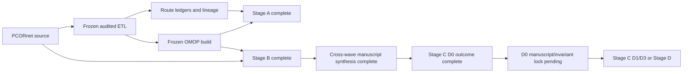
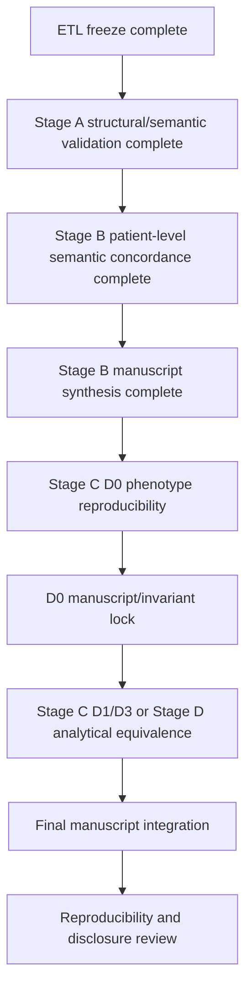

# Current status and publication plan

_Last updated: 2026-08-28_

For the full historical record and methodological decisions, see `docs/project_history_and_decisions.md`. For completed Stage A findings, see `docs/stage_a_structural_semantic_results.md`. For locked Stage B results, see `docs/stage_b_wave1_lock_record.md`, `docs/stage_b_wave2_lock_record.md`, and `docs/publication_stage_b_manuscript_draft.md`.

## Current status

The audited PCORnet-to-OMOP ETL is frozen for publication at:

`887e6f4d60a6b185e58b3c9fe8887472b49777e3`

The final rebuild was executed from an empty isolated validated target, with the comparator/prior OMOP database left untouched. The freeze passed matched global reconciliation, matched visit-time semantics, zero duplicate primary-key groups, zero reversed audited intervals, zero hard semantic blockers, zero unexplained review flags, zero auxiliary concept blockers, and a clean Phase 14 worktree.

Publication analysis proceeds on `publication/analysis`. The frozen ETL is immutable unless a new independently demonstrated ETL defect requires a documented new freeze.

## Frozen OMOP target counts

| OMOP table | Rows |
| --- | ---: |
| person | 27,089 |
| observation_period | 27,087 |
| visit_occurrence | 1,510,957 |
| condition_occurrence | 7,315,572 |
| procedure_occurrence | 4,182,803 |
| measurement | 85,715,435 |
| observation | 7,319,081 |
| drug_exposure | 48,458,058 |
| device_exposure | 196,660 |
| specimen | 93 |
| death | 6,955 |

These counts are recorded outcomes, not acceptance thresholds.

## Stage A status — complete

Stage A structural and semantic concordance is complete. The final package includes source eligibility and exact exclusion reasons, source-to-route and route-to-target reconciliation, concept-0 summaries, visit/unit/route coverage, cross-domain routing, Procedure dispositions and target-domain summaries, Condition canonical routing, OBS_CLIN routing, mapping-mechanism summaries, and manuscript-oriented outputs.

Key findings include 16,924 PROCEDURES exclusions due to missing `PX_DATE`, 3,459,785 DIAGNOSIS exclusions due to missing `DX_DATE`, explicit one-to-many route expansion, 60,148 Condition concept-zero fallbacks, 12,737 unresolved OBS_CLIN Observation routes, and 17,469,480 Drug concept-zero routes. These are documented outputs and coverage findings, not comparator-based acceptance targets.

## Stage B status — analytically complete and locked

Both Stage B waves are complete downstream of the frozen ETL.

Wave 1 covered Encounter, Death, Condition, and Procedure. Encounter and Death were exactly concordant. All 8,983,621 mapped Condition semantic routes and all 11,121,561 mapped Procedure event routes were found exactly in native OMOP. Apparent target-side excess in the same semantic spaces was completely explained by other audited source provenance. Wave 1 finished with all manuscript invariants matched and is locked.

Wave 2 covered Drug and Measurement/Observation semantics plus numeric, UCUM, and categorical value layers. All 30,988,400 mapped Drug routes and all 92,668,145 mapped Measurement/Observation semantic rows matched exactly with zero source-unmatched mapped rows. Drug target excess was limited to 48 rows and was fully attributed to other provenance. All 58,916,347 uniquely resolved active Standard UCUM units and all 809,630 prespecified mapped categorical Standard values agreed exactly. The 125,622 direct native-field VITAL numeric differences were fully explained by the frozen ETL SQL expression, leaving zero unexplained target mismatches. The final Wave 2 disclosure review passed.

The cross-wave Stage B synthesis is implemented in `stage_b_cross_wave_manuscript_bundle.py`, and manuscript-oriented Methods/Results text is drafted in `docs/publication_stage_b_manuscript_draft.md`.

## Stage C status — D0 outcome complete; lock pending

The first Stage C phenotype is the locked PSU PROMIS EHR-only ischemic-stroke D0 definition in `study_definitions/stage_c_stroke_d0_v1.json`. The specification was locked before the publication D0 outcome query.

The preflight passed: all 27,089 source PATIDs linked uniquely to OMOP persons, all 127 locked ICD codes resolved through the frozen vocabulary, the frozen EI/IP Visit concepts were valid active Standard concepts, and PCORnet `PDX` was confirmed not to have a native OMOP core equivalent.

Primary transformation-fidelity D0 results:

- source D0 patients: **9,815**;
- lineage-faithful OMOP D0 patients: **6,001**;
- shared patients: **6,001**;
- source-only patients: **3,814**;
- OMOP-only patients: **0**;
- patient Jaccard: **0.6114111055**;
- positive agreement: **75.8852%**;
- exact index-date agreement among shared patients: **100%**.

All 3,814 source-only patients fall into the prespecified `required_source_date_missing_or_etl_excluded` category. The locked source phenotype allows index-date fallback to encounter dates when `DX_DATE` is absent, whereas the frozen ETL excludes diagnoses missing the required diagnosis date. This is a documented phenotype/ETL policy interaction rather than unexplained transformed-event loss.

The secondary native-OMOP portability sensitivity intentionally omits `PDX == 'P'` because it is not natively representable. It yielded 7,667 OMOP patients, 6,312 shared patients, 3,503 source-only patients, and 1,355 native-OMOP-only patients (Jaccard 0.5650850492). This remains a separate portability estimand.

`stage_c_stroke_d0_manuscript_tables.py` has been added to assemble the aggregate D0 manuscript/invariant bundle and disclosure review. D0 is not considered locked until that bundle passes locally.

## Methodological decisions that remain fixed

- Do not use the comparator OMOP database as an ETL acceptance target.
- Do not require raw row-count equality between PCORnet and OMOP where one-to-many or cross-domain semantics apply.
- Preserve one-to-many Standard mappings and cross-domain routes.
- Do not choose arbitrary vocabulary candidates.
- Use concept `0` when source semantics do not justify a unique Standard concept.
- Retain non-event semantic targets in route ledgers rather than creating false standalone events.
- Exclude missing required dates explicitly rather than inventing sentinel dates.
- Do not retune ETL mappings from downstream concordance findings alone.
- Use target lineage only for secondary attribution after primary native-CDM semantic comparison, except where a locked Stage C transformation-fidelity phenotype requires a source-only semantic not represented natively in OMOP core.
- Keep unresolved vocabulary/unit/value mappings separate from mapped semantic agreement.
- Do not change Stage C phenotype rules after outcome inspection merely to improve agreement.

## Publication roadmap

### Stage C — phenotype reproducibility

D0 outcome analysis is complete under its locked definition. The immediate task is to run and lock the aggregate D0 manuscript/invariant bundle. D1 and D3 remain deferred until their lipid LOINC whitelist is versioned or hashed as a reproducible study artifact before any D1/D3 outcome comparison.

### Stage D — analytical equivalence

After the relevant phenotype reproducibility analyses are locked, run matched prespecified downstream analyses in both CDMs and compare estimates, uncertainty, calibration/discrimination where applicable, and substantive conclusions. Do not reduce equivalence to p-value threshold crossing.

## Immediate next steps

1. Run `stage_c_stroke_d0_manuscript_tables.py` locally and confirm all invariants and disclosure checks.
2. If it passes, create the D0 Stage C lock record and close Issue #11.
3. Decide whether the next Stage C wave is D1/D3 after versioning the lipid LOINC whitelist, or whether D0 is sufficient to proceed to a prespecified Stage D analysis.
4. Keep all row-level outputs outside Git; only aggregate disclosure-reviewed summaries should be committed.

## Manuscript framing

The paper should preserve a clear separation among three questions:

1. **Did the audited ETL behave as specified?** The frozen rebuild and Stage A answer this with matched reconciliation, zero hard/unexplained blockers, explicit exclusions, and quantified routing/mapping behavior.
2. **Were mapped patient-level clinical semantics preserved after transformation?** Stage B answers this with exact mapped-event concordance across Encounter, Death, Condition, Procedure, Drug, and Measurement/Observation, while separately quantifying provenance overlap and unresolved coverage.
3. **Do full phenotypes and downstream scientific analyses remain reproducible across CDMs?** Stage C D0 already demonstrates that a complete phenotype can diverge despite exact mapped-event concordance when its source definition relies on a date fallback that conflicts with the frozen ETL required-date policy and on a source semantic (`PDX`) not natively represented in OMOP core. Stage D will test whether such representational differences alter downstream scientific conclusions.

This separation prevents defects in a historical converter, vocabulary coverage limitations, and legitimate multi-source OMOP representation from being mistaken for intrinsic differences between the PCORnet and OMOP data models.

## Reproducibility rule

Every publication analysis run should record the frozen ETL SHA, analysis-code SHA, configuration hash without secrets, study-definition version, input audit/freeze-manifest hashes, run timestamp, and output hashes/counts sufficient to regenerate tables and figures. Row-level data remain outside Git; aggregate outputs require disclosure review before external sharing.
