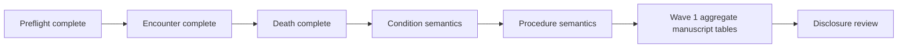

# Stage B Wave 1 progress

Frozen ETL SHA: `887e6f4d60a6b185e58b3c9fe8887472b49777e3`

Locked study definition: `study_definitions/stage_b_v1.json`

This document records Stage B Wave 1 implementation and results as they are generated. Primary concordance uses independently defined native PCORnet and OMOP queries where possible. For semantic domains that require vocabulary normalization, the frozen route ledger is used only as the prespecified source-side semantic reference; target OMOP event retrieval remains native and target lineage/xwalks are reserved for secondary discordance attribution.

## Preflight

Stage B Wave 1 preflight completed successfully on 2026-08-27.

- study definition: `stage-b-v1`
- patient linkage: `matched_unique_source_bridge`
- source tables present: 5
- target tables present: 10
- lineage tables present: 14
- analysis worktree: clean

## Encounter / Visit concordance

The first native-CDM patient-level comparison completed successfully.

Primary results:

- PCORnet eligible encounters: **1,510,957**
- OMOP visit rows: **1,510,957**
- source patients with encounters: **27,087**
- OMOP patients with visits: **27,087**
- shared patients: **27,087**
- source-only patients: **0**
- OMOP-only patients: **0**
- patient Jaccard: **1.0**
- patients with unequal event counts: **0**
- exact person + start-date matched events: **1,510,957**
- source unmatched date events: **0**
- OMOP unmatched date events: **0**

Interpretation: under the pre-specified Stage B encounter definition, patient presence, per-patient encounter counts, and exact calendar start-date event multisets are fully concordant between native PCORnet ENCOUNTER and frozen OMOP Visit Occurrence. This result was computed without using the encounter-to-visit xwalk in the primary metrics.

Encounter type is descriptive rather than an exact-equality acceptance criterion because PCORnet encounter categories and OMOP Standard Visit concepts are representationally different semantic systems. Source encounter type and OMOP visit concept/source value distributions are retained as secondary characterization outputs.

## Death concordance

The native-CDM death comparison completed successfully.

Primary results:

- PCORnet eligible death events: **6,955**
- OMOP death rows: **6,955**
- source patients with death: **6,955**
- OMOP patients with death: **6,955**
- shared patients: **6,955**
- source-only patients: **0**
- OMOP-only patients: **0**
- patient Jaccard: **1.0**
- exact death-date matches: **6,955**
- discordant date pairs: **0**

Interpretation: patient-level death presence and exact calendar death date are fully concordant between native PCORnet DEATH and frozen OMOP Death under the locked Stage B v1 definition. The death xwalk was not used to define the primary result.

Death type and cause concept equality are not Stage B concordance requirements because the frozen ETL explicitly retains concept `0` where source provenance/cause semantics do not justify an exact OMOP concept.

## Condition semantic concordance

Implementation is now committed. The primary semantic comparison is pre-specified as follows:

- the frozen canonical Condition route ledger supplies the source-side Standard concept/domain semantic reference for eligible DIAGNOSIS and CONDITION events;
- this route ledger is being used as a vocabulary normalization reference, not as a target-event lineage lookup;
- mapped nonzero routes are compared against native OMOP event tables in the appropriate target domain;
- target lineage/xwalks are not used in primary metrics;
- concept-0 fallback is reported separately as represented-but-unresolved;
- one-to-many Standard routes are preserved rather than collapsed;
- cross-domain routes are evaluated in Condition, Observation, Procedure, Measurement, Drug, Device, or Specimen as appropriate;
- exact event agreement is a multiset comparison on person, calendar date, OMOP domain, and Standard concept.

This design avoids treating raw source-row equality or Condition Occurrence-only equality as the semantic target while still preventing target lineage from defining the primary concordance result.

## Remaining Wave 1 sequence

Condition and Procedure comparisons preserve the locked rule that one-to-many and cross-domain Standard mappings are not automatically discordant. Target lineage will be used only after primary semantic results are computed to classify disagreement.
