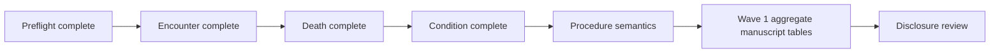

# Stage B Wave 1 progress

Frozen ETL SHA: `887e6f4d60a6b185e58b3c9fe8887472b49777e3`

Locked study definition: `study_definitions/stage_b_v1.json`

This document records Stage B Wave 1 implementation and results as they are generated. Primary concordance uses independently defined native PCORnet and OMOP queries where possible. For semantic domains that require vocabulary normalization, the frozen route ledger is used only as the prespecified source-side semantic reference; target OMOP event retrieval remains native and target lineage/xwalks are reserved for secondary discordance attribution.

## Preflight

Stage B Wave 1 preflight completed successfully on 2026-08-27.

- study definition: `stage-b-v1`
- patient linkage: `matched_unique_source_bridge`
- source tables present: 5
- target tables present: 10
- lineage tables present: 14
- analysis worktree: clean

## Encounter / Visit concordance

The first native-CDM patient-level comparison completed successfully.

Primary results:

- PCORnet eligible encounters: **1,510,957**
- OMOP visit rows: **1,510,957**
- source patients with encounters: **27,087**
- OMOP patients with visits: **27,087**
- shared patients: **27,087**
- source-only patients: **0**
- OMOP-only patients: **0**
- patient Jaccard: **1.0**
- patients with unequal event counts: **0**
- exact person + start-date matched events: **1,510,957**
- source unmatched date events: **0**
- OMOP unmatched date events: **0**

Interpretation: under the pre-specified Stage B encounter definition, patient presence, per-patient encounter counts, and exact calendar start-date event multisets are fully concordant between native PCORnet ENCOUNTER and frozen OMOP Visit Occurrence. This result was computed without using the encounter-to-visit xwalk in the primary metrics.

Encounter type is descriptive rather than an exact-equality acceptance criterion because PCORnet encounter categories and OMOP Standard Visit concepts are representationally different semantic systems. Source encounter type and OMOP visit concept/source value distributions are retained as secondary characterization outputs.

## Death concordance

The native-CDM death comparison completed successfully.

Primary results:

- PCORnet eligible death events: **6,955**
- OMOP death rows: **6,955**
- source patients with death: **6,955**
- OMOP patients with death: **6,955**
- shared patients: **6,955**
- source-only patients: **0**
- OMOP-only patients: **0**
- patient Jaccard: **1.0**
- exact death-date matches: **6,955**
- discordant date pairs: **0**

Interpretation: patient-level death presence and exact calendar death date are fully concordant between native PCORnet DEATH and frozen OMOP Death under the locked Stage B v1 definition. The death xwalk was not used to define the primary result.

Death type and cause concept equality are not Stage B concordance requirements because the frozen ETL explicitly retains concept `0` where source provenance/cause semantics do not justify an exact OMOP concept.

## Condition semantic concordance

The optimized Condition comparison completed successfully.

Primary results:

- eligible DIAGNOSIS + CONDITION source events represented in the canonical route ledger: **8,674,973**
- core semantic route rows: **9,043,769**
- mapped nonzero Standard route rows: **8,983,621**
- unresolved concept-0 fallback rows: **60,148**
- source events with multiple core routes: **361,606**
- source mapped patients: **25,614**
- native OMOP patients in the same mapped concept space: **26,388**
- shared mapped patients: **25,614**
- source-only mapped patients: **0**
- target-only patients in the same concept space: **774**
- patient Jaccard before provenance attribution: **0.9706684857**
- exact person/date/domain/concept matched mapped events: **8,983,621**
- source unmatched mapped semantic events: **0**
- target unmatched rows in the same semantic concept space: **756,113**

The primary result therefore shows complete preservation of every mapped nonzero Condition semantic route: all 8,983,621 mapped source semantic events were found exactly in native OMOP using the pre-specified person + calendar date + OMOP domain + Standard concept multiset comparison. No target lineage was used to obtain that primary result.

Secondary lineage attribution then classified the apparent OMOP excess:

- native OMOP rows in Condition semantic concept space: **9,739,734**
- Condition-derived rows: **8,983,621**
- rows from other audited source provenance: **756,113**
- target-only patients relative to the Condition-derived patient set: **774**

Thus the entire target-side excess is explained by other source families populating the same OMOP Standard concept/domain space. It is not evidence of loss or duplication of mapped DIAGNOSIS/CONDITION semantics. This is a substantive study finding: native OMOP concept-space queries can legitimately include clinically equivalent events originating from multiple PCORnet source domains, so lineage-aware attribution is required to distinguish semantic overlap from ETL discordance.

Concept-0 fallback remains a separate unresolved-coverage result and is not counted as mapped semantic concordance.

## Remaining Wave 1 sequence

Condition and Procedure comparisons preserve the locked rule that one-to-many and cross-domain Standard mappings are not automatically discordant. Target lineage is used only after primary semantic results are computed to classify disagreement.
