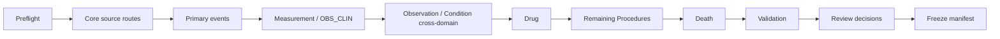

# ETL code guide

This directory contains the audited PCORnet-to-OMOP transformation and supporting audits.

## Start here

For the publication ETL, read the clean-build sequence in numerical order. The phase files intentionally expose dependency boundaries and review checkpoints.

## Scientific conventions implemented here

- **Required dates:** if OMOP requires a date and the source event lacks the required date, the event is explicitly excluded rather than assigned a fake date.
- **Concept 0:** used when the source event exists but a defensible unique Standard concept cannot be assigned.
- **One-to-many mapping:** preserved where vocabulary semantics require it; therefore source and target row counts need not match.
- **Cross-domain routing:** routed according to the mapped Standard concept domain rather than source table name alone.
- **Lineage/crosswalks:** retained to prove where a source event materialized and to diagnose downstream discrepancies. They are validation infrastructure, not a substitute for native OMOP semantics.
- **Comparator independence:** a prior OMOP build is not used as the acceptance target for this ETL.

## Why there are many audit modules

The project deliberately separates transformation from evidence about transformation. Modules containing terms such as `audit`, `reconcile`, `readiness`, `routes`, or `freeze` often produce evidence used to decide whether a transformation is defensible; they are not necessarily additional materialization steps.

## Freeze

The publication ETL is frozen at commit:

`887e6f4d60a6b185e58b3c9fe8887472b49777e3`

Later publication-analysis commits do not retroactively alter the scientific interpretation of that frozen ETL.

For the overall study logic, read `docs/02_STUDY_DESIGN_AND_DECISIONS.md` before reviewing individual ETL modules.
