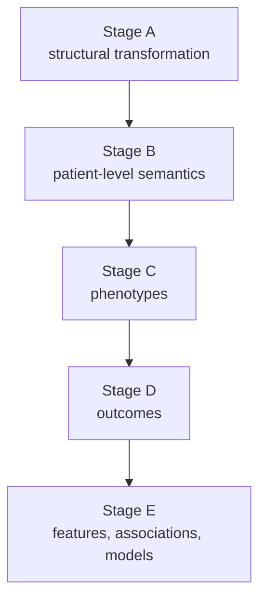

# Study-analysis code guide

This directory contains the publication validation analyses. Scientific intent is versioned in `study_definitions/`; the Python modules implement those definitions and enforce provenance/anchor checks.

## Read definitions before code

For any stage, first open the corresponding JSON under `study_definitions/`. Those files state the locked cohort/outcome/feature definitions. Python code should not be treated as an invitation to infer or modify the estimand after results are known.

## Stage map

## Primary vs sensitivity vs diagnostic

File names alone do not always convey the inferential role. Use these conventions:

- `*_preflight.py`: verifies definitions/inputs before outcome-sensitive execution.
- `*_concordance.py` or primary stage module: implements the locked primary comparison.
- `*_sensitivity.py`: answers a deliberately altered secondary question; does not replace the primary result.
- `*_audit.py`, `*_diagnostic.py`, `*_discordance.py`: explains a discrepancy after it is observed unless the associated study definition says otherwise.
- `*_completion_supplement.py`: completes a prespecified output without redefining the study.

## Critical distinctions

### Stage C

The original source-faithful stroke phenotype allows the source's encounter-date fallback behavior. The harmonized `DX_DATE` sensitivity deliberately removes that asymmetry. Do not merge the two estimands.

### Stage D

- **Fixed-index:** same patient/index/follow-up; tests outcome representation.
- **End-to-end:** independently constructed cohorts; tests complete study reproducibility.

Exact fixed-index outcomes can coexist with different end-to-end risks because the populations differ.

### Stage E

The completed publication execution uses `stage_e_statistical_model_reproducibility_anchorfix.py`. The first execution stopped before model fitting because an anchor assertion detected incorrect re-selection of the earliest surviving OMOP episode. The wrapper restores the locked Stage C episode-selection semantics and does not alter features, outcome, split, models, or metrics.

## Why anchor checks are strict

Assertions on counts, hashes, and prior-stage anchors are intentional. They protect against silently running a later-stage analysis on a different ETL version or cohort definition.

For collaborator review, pair this file with `docs/05_CODE_REVIEW_GUIDE.md`.
